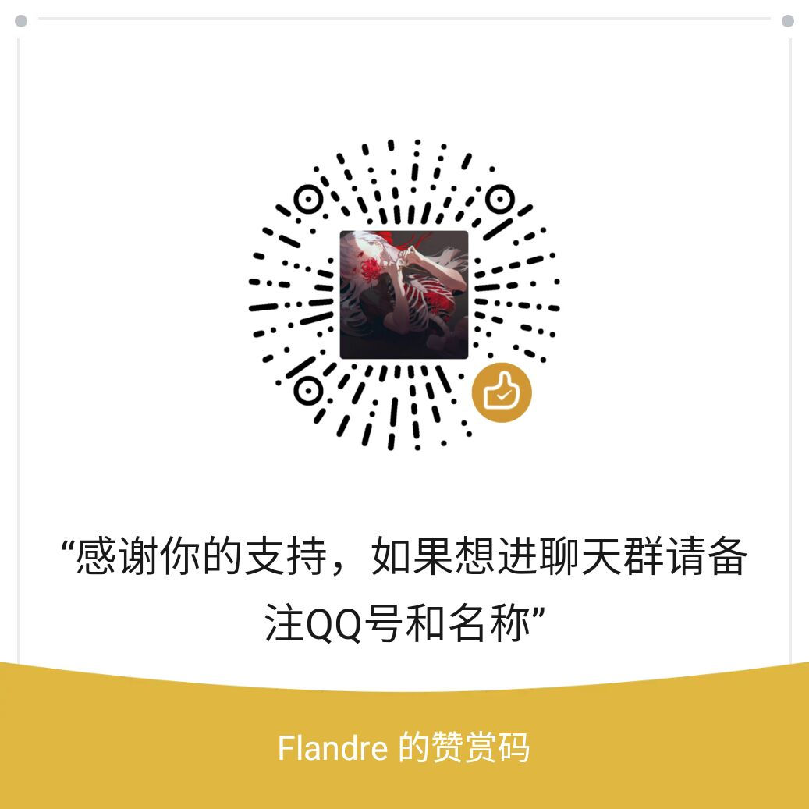

# 简介

此内容是视频简介的导航内容，你可以在这里找到一些教程资源和我个人地
址。如果你有什么提问的问题还请在Kook中提出，一般大家会有回复，我看到如果知道怎么处理也会回答。

关于发电，如果你在爱发电或者B站充电或者以其他形式发电支持，并希望加入到QQ发电群的话，还请在发电的途径留下你的联系方式，我也好同意进群。

此内容会不断变化，补充，如果你有什么需要补充的可以在视频评论区提出。

# 链接

[Kook邀请地址](https://kook.top/qVjevH)

[个人博客地址](https://fuwari-ald.pages.dev)

[个人github地址](https://github.com/flandre923)

[爱发电](https://afdian.com/a/flandre923)

[Bilibili个人主页](https://space.bilibili.com/4550069)

# 导航站

介绍视频代码参考的内容，以及一些工具方便大家索引和寻找

[bason博客地址](https://boson.v2mcdev.com/introducation/intro.html)  这是一份关于1.16.5的教程，非常详细介绍了MC的各个模块的内容，代码或许有一定的过时，不过还是可以帮助你了解MC编码的一些思想

[我的世界wiki](https://zh.minecraft.wiki/) 我的世界wiki，了解原版的机制和数据包的内容时候十分有用，尤其在数据包时候可以帮助你了解各个字段的含义。

[Kaupenjoe](https://www.youtube.com/@ModdingByKaupenjoe) 非常好的教程，涉及fabric和forge各个版本，内容全面，不过需要英文能力并且需要一定的魔法。

[我的世界中文导航](https://github.com/mouse0w0/MinecraftDeveloperGuide) 很全的导航，涉及各个工具的相关内容。你可以在这里找到你想要的东西

[TeaConKook频道](https://kaihei.co/HyypQI) 国内的我的世界模组开发频道，每年会举办模组开发大会，Teacon，大佬很多，有问题可以在这里求助。

[Neoforge文档](https://docs.neoforged.net/) Neoforge的官方文档，比较详细的描述了各个个功能，不过内容比较多，适合英语阅读能力和对MC编程有一定的理解的人阅读，不然会读一头雾水。

[Iron's Spells 'n Spellbooks MC百科](https://www.mcmod.cn/class/10175.html)

[Iron's Spells 'n Spellbooks GitHub仓库](https://github.com/iron431/Irons-Spells-n-Spellbooks)
# 工具

[IDEA](https://www.jetbrains.com/zh-cn/idea/)
[JAVA](https://adoptium.net/)
[Neoforge MDK](NeoForge:https://neoforged.net/)