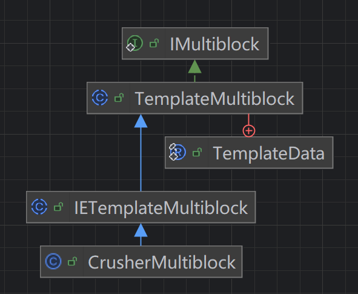
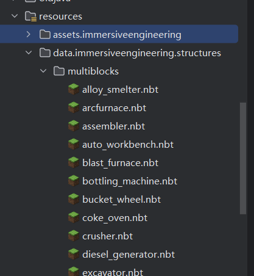
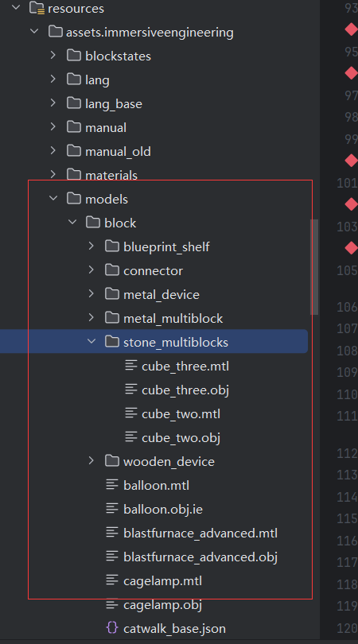

# 00 总体性介绍

# 01

​`IEMultiblocks`​是一个静态的初始化的类，用于注册沉浸中的各种多方块机器。例如高炉，焦炉，粉碎机，合金炉等。

我们用粉碎机作为例子说下整个多方块机器的结构

​​

​`CrusherMultiblock`​继承`IETemplateMultiblock`​。

```java
		super(new ResourceLocation(ImmersiveEngineering.MODID, "multiblocks/crusher"),//标识id
				CrusherLogic.MASTER_OFFSET, new BlockPos(2, 1, 2), new BlockPos(5, 3, 3), // master方块位置，trigger方块位置，大小
				IEMultiblockLogic.CRUSHER);// 方块行为逻辑，粉碎机可以粉碎矿物，代码定义。
```

​`IETemplateMultiblock`​抽象类，继承于`TemplateMultiblock`​，

* 构造器：初始化多方块模板，记录多方块的逻辑信息。
* replaceStructureBlock：

  * 设置方块状态。
  * 更新方块实体位置。
  * 标记方块更新。
* getSize：返回多方块的大小。
* getTemplate：

  * 获取模板数据。
  * 确认模板尺寸正确。
* prepareBlockForDisassembly：准备方块破坏。
* initializeClient：初始化客户端数据。
* getBlockName：获取方块资源名称。
* getDisplayName：获取显示名称。
* getBlock：获取方块实例。

​`TemplateMultiblock`​类实现了`IMultiblock`​，对接口定义的行为有一定的实现，主要涉及到了对于结构模板的旋转匹配等操作。以创建多方块机器时候将机器方块替换掉构建方块。以及机器拆除时候的方法。

​`IMultiblock`​接口定义了多方块结构的行为方法，包含了如何判断是否是当前的机器，以及如何创建当前的机器，以及如何拆除当前的机器等接口。

‍

# 02 

到这里我们说一下，整个机器的创建逻辑是什么样子的。对于机器，当你放下构建方块排放好了之后，用锤子右键触发方块，那么此时会对所有的机器进行遍历，看当前的结构是否和目标的结构匹配，匹配上了，就会将机器的方块替换掉原先的构建方块，此时整个机器就构建完成了。

再说破坏，当你破坏一个机器的方块时候，机器就会调用方块的破坏方法，读取对于的模板结构的方块数据，将机器的方块替换回原先的构建方块。

举个高炉的例子， 你放置3*3\*3的高炉砖，右键中间的方块时候，会更加你右键的面调整模板结构（NBT数据）的方向，最后和你放置的方块匹配，然后成功就将高炉方块替换掉高炉砖方块。完成构建。

‍

# 03 模板结构数据NBT

这个数据在这里放置了多方快结构的所有模板数据，这个就决定了你的构建机器的方块应该摆成什么样子，例如高炉就是3*3\*3的高炉砖。其他也是类似，这个模板数据你可以在游戏中搭建，然后通过结构方块（该方块你可以通过指令获得，原版提供的功能）获得。

‍

# 04 机器模型

对于机器的模型，是一整个OBJ文件，然后按照多方块的位置切换整个模型的渲染定点信息。然后在渲染具体的方块时候，会根据对应的方块的位置返回对应该位置上的顶点信息，这样整个机器看起来是一整个模型，同时还保留了多个方块的特点。

模型放在了。

​对于3*3 *** 3的结构来说，他们是同一个模型cube_three.obj，然后不同的贴图。另外对于blockstate，和block的json文件是通过datagen的方式生成的，block的model的json文件是自己写的加载，使用了neoforge提供的obj加载，并添加了切分方块的功能。` blusunrize.immersiveengineering.client.models.split;`​包下的类是对于的加载器。

‍

# 05 方块实体逻辑

机器方块的注册，机器方块的方块实体，逻辑处理，数据存储等功能，沉浸将其抽象为了一个`MultiblockRegistration`​，这个`MultiblockRegistration`​你需要取定义这个机器对于的机器方块是什么，方块实体是什么，以及数据存储的逻辑和对应有上面组件是否有GUI，是否处理红石信号，是否处理比较器信号等内容。

首先是`IMultiblockLogic`​每个机器都有一个`IMultiblockLogic`​实现，`IMultiblockLogic`​表示了机器的工作逻辑，例如焦炉是烧焦煤的并且生成煤焦油。粉碎机是粉碎矿物的。Logic包含了处理的逻辑，数据存储的方法和格式等内容。

对于机器方块实体的调用逻辑是将对于的tick委托给对于的helper，然后helper在根据当前的机器是否有tickserver进行调用`MultiblockRegistration`​的tickserver以及组件的tickserver方法（tickclient同理）。而tickerserver是`IMultiblockLogic`​的内容，对处理机器的逻辑，实现输入，输出，处理等功能。

对于机器的方块实体来说，有两部分，一部分是Master方块实体，另一部分是Dummy方块实体，Master方块实体是主方块实体，我们上述提到的tick和数据的save，load都是由Master来操作的。他的位置就是指定的机器的主方块的位置。Dummy方块实体是除了主方块实体其他的方块的方块实体，他们不处理数据，负责交互，和主方块实体沟通，例如，对于一个由GUI的机器，你右键了一个机器方块，这个机器方块有可能是Dummy的方块实体，那么他会获得机器的Master方块实体，然后获得对应的组件，调用组件的click方块，如果改组件是GUI组件，机会打开对应的GUI。

‍
