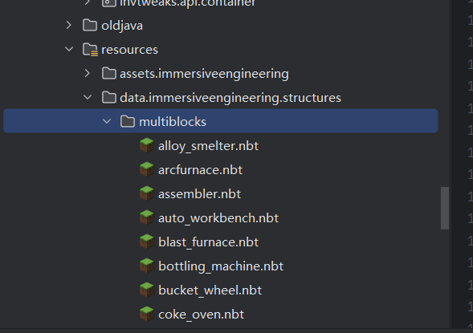

# 02 多方块结构的创建过程

多方块的构建最初是从锤子的物品的右键开始的。

```java

public class HammerItem extends IEBaseItem
{
	public HammerItem()
	{
		super(new Properties().defaultDurability(100));// Value is overridden in getMaxDamage
	}

	@Override
	public InteractionResult onItemUseFirst(ItemStack stack, UseOnContext context)
	{
		Level world = context.getLevel();
		BlockPos pos = context.getClickedPos();
		Player player = context.getPlayer();
		Direction side = context.getClickedFace();

		/*
			Multiblock Handling
		 */
		List<ResourceLocation> permittedMultiblocks = null;
		List<ResourceLocation> interdictedMultiblocks = null;

// 然后根据物品的NBT数据，检查是否有权限和禁止的多块数据，
		if(ItemNBTHelper.hasKey(stack, "multiblockPermission"))
		{
			ListTag list = stack.getOrCreateTag().getList("multiblockPermission", Tag.TAG_STRING);
			permittedMultiblocks = parseMultiblockNames(list, player, "permission");
			if(permittedMultiblocks==null)
				return InteractionResult.FAIL;
		}
		if(ItemNBTHelper.hasKey(stack, "multiblockInterdiction"))
		{
			ListTag list = stack.getOrCreateTag().getList("multiblockInterdiction", Tag.TAG_STRING);
			interdictedMultiblocks = parseMultiblockNames(list, player, "interdiction");
			if(interdictedMultiblocks==null)
				return InteractionResult.FAIL;
		}
// 根据点击的方块面和玩家的方向确定多块的放置方向。
		final Direction multiblockSide;
		if(side.getAxis()==Axis.Y&&player!=null)
			multiblockSide = Direction.fromYRot(player.getYRot()).getOpposite();
		else
			multiblockSide = side;
		for(MultiblockHandler.IMultiblock mb : MultiblockHandler.getMultiblocks())
// isBlockTrigger这里的就是接口的判断是否是一个合适的触发位置并且是一个合理的多方块结构。
			if(mb.isBlockTrigger(world.getBlockState(pos), multiblockSide, world))
			{
				boolean isAllowed;
				if(permittedMultiblocks!=null)
					isAllowed = permittedMultiblocks.contains(mb.getUniqueName());
				else if(interdictedMultiblocks!=null)
					isAllowed = !interdictedMultiblocks.contains(mb.getUniqueName());
				else
					isAllowed = true;
				if(!isAllowed)
					continue;
// 触发构建多方块结构的事件，如果事件被取消这直接返回
				if(MultiblockHandler.postMultiblockFormationEvent(player, mb, pos, stack).isCanceled())
					continue;
// 构建多方块结构
				if(mb.createStructure(world, pos, multiblockSide, player))
				{
// 触发成就
					if(player instanceof ServerPlayer sPlayer)
						MultiblockAdvancementTrigger.INSTANCE.get().trigger(sPlayer, mb, stack);
					return InteractionResult.SUCCESS;
				}
			}

// 处理机器旋转等信息的操作。这里我们直接略过
		/*
			Side Configs & Rotation Handling
		 */
		BlockEntity tile = world.getBlockEntity(pos);
		if(tile instanceof IConfigurableSides sideConfig)
		{
			Direction activeSide = ((player!=null)&&player.isShiftKeyDown())?side.getOpposite(): side;
			if(sideConfig.toggleSide(activeSide, player))
				return InteractionResult.SUCCESS;
			else
				return InteractionResult.FAIL;
		}
		else if (world.getBlockState(pos).getBlock() instanceof IHammerBlockInteraction block)
		{
			return block.useHammer(world.getBlockState(pos), world, pos, player);
		}
		else
		{
			boolean rotate = !(tile instanceof IDirectionalBE)&&!(tile instanceof IHammerInteraction);
			if(!rotate&&tile instanceof IDirectionalBE dirBE)
				rotate = dirBE.canHammerRotate(side, context.getClickLocation().subtract(Vec3.atLowerCornerOf(pos)), player);
			if(rotate&&RotationUtil.rotateBlock(world, pos, player!=null&&(player.isShiftKeyDown()!=side.equals(Direction.DOWN))))
				return InteractionResult.SUCCESS;
			else if(!rotate&&tile instanceof IHammerInteraction hammerInteraction)
			{
				if(hammerInteraction.hammerUseSide(side, player, context.getHand(), context.getClickLocation()))
					return InteractionResult.SUCCESS;
			}
		}
		return InteractionResult.PASS;
	}
}

```

这里与我们想讲的内容主要有三点

1. ```java
     // 这个方法可以返回所有的多方块机构
    	public static List<IMultiblock> getMultiblocks()
    	{
    		return multiblocks;
    	}
    ```

2. ​`isBlockTrigger`​是用来判断是否是合法的触发方块

    ```java
    		boolean isBlockTrigger(BlockState state, Direction side, @Nonnull Level world);
    ```
3. ​`createStructure`​是来检验合法性并且构建多方块结构的。

    ```java
    		boolean createStructure(Level world, BlockPos pos, Direction side, Player player);

    ```

这几个方法都是`MultiblockHandler`​的接口方法。

‍

# 下面让我们来看`isBlockTrigger`​的具体实现

​`TemplateMultiblock`​类

```java

	@Override
	public boolean isBlockTrigger(BlockState state, Direction d, @Nonnull Level world)
	{
		getTemplate(world); // 确保多方块结构的size和模板size是一致的，并保证多方块是初始化完毕的。
		Rotation rot = DirectionUtils.getRotationBetweenFacings(Direction.NORTH, d.getOpposite());// 获得实际上的搭建的方块的旋转
		if(rot==null)
			return false;
		final BlockState trigger = getTemplate(world).triggerState;// 获取模板中的触发器方块状态
		for(Mirror mirror : getPossibleMirrorStates())// 遍历所有可能的镜像状态
		{
			BlockState modifiedTrigger = applyToState(trigger, mirror, rot);
			if(BlockMatcher.matches(modifiedTrigger, state, null, null, additionalPredicates).isAllow()) // 触发方块匹配上了
				return true;
		}
		return false;
	}
```

这个方法的主要流程就是获得所有的多方块结构的nbt模板（原版template模板建筑用nbt数据存储）然后对比所有的该多方块结构的镜像状态在对于旋转下的结构信息是否对应上，对应上了就说明是一个合理的多方块结构。

‍

# 这里我们补充下`getTemplate`​方法的实现。

​`IETemplateMultiblock`​

```java

	@Nonnull
	@Override
	public TemplateData getTemplate(@Nonnull Level world)
	{
		TemplateData result = super.getTemplate(world);
		final Vec3i resultSize = result.template().getSize();
		// 检查模板尺寸是否与预期的尺寸一致
		Preconditions.checkState(
				resultSize.equals(size),
				"Wrong template size for multiblock %s, template size: %s",
				getTemplateLocation(), resultSize
		);
		return result;
	}

```

```java
// TemplateMultiblock

	@Nonnull
	public TemplateData getTemplate(@Nonnull Level level)
	{
		ensureStructureInitialized(level);
		return Objects.requireNonNull(template);
	}

```

主要工作就是确保加载的`template`​非空，并且保证当前的多方块结构和加载的模板nbt结构的大小是一致的。

‍

# `TemplateMultiblock`​下template是怎么来的

在游戏的资源这个目录下，你可以找到多方块结构的nbt模板数据。这里包含了各个机器的多方块结构的数据。

​​

我们先来看一个数据结构，这个数据结构是`getTemplate`​放回的类型--`TemplateData`​。

```java

	public record TemplateData(
			StructureTemplate template, // 原版的类，这个类是读入的nbt数据的内容，包含了各个方块的位置信息和状态。
			List<StructureBlockInfo> blocksWithoutAir, // 提取nbt模板结构数据，去除空气方块
			BlockState triggerState // 对于的触发多方块结构创建的方块state
	)
	{
	}
```

在模组启动时候会读取文件中的nbt 数据，并将其保存在`SYNCED_CLIENT_TEMPLATES`​中。

```java
// 简化版
	private void ensureStructureInitialized(@Nonnull Level level) // 确保template是存在的。 
	{
		final StructureTemplate newTemplate;
// 获得对于的template 对于服务器和客户端不一样
		if(level instanceof ServerLevel serverLevel)
			newTemplate = serverLevel.getStructureManager().get(loc).orElse(null);
		else 
		{
			newTemplate = SYNCED_CLIENT_TEMPLATES.get(loc);
		}

		if(this.template!=null&&newTemplate==template.template) //如果之前初始化了，直接返回
		List<StructureBlockInfo> blocksWithoutAir = new ArrayList<>(getStructureFromTemplate(newTemplate));

		final Iterator<StructureBlockInfo> it = blocksWithoutAir.iterator();
		BlockState trigger = null;
		while(it.hasNext())
		{
				// 去掉空气方块
。				// 查找触发方块的位置
		}
		Preconditions.checkState(trigger!=null, "Trigger state was not found in template for "+loc);
		this.template = new TemplateData(newTemplate, blocksWithoutAir, trigger);
		//更新内部模板数据:
	}
```

‍

# 好了下面来看`createStructure`​

这里就涉及到在合适的位置构建多方块结构了。

首先是，这个方法的作用时返回多方块结构的方块的信息。StructureBlockInfo就是我们上述提到的TemplateData的第二个字段。

```java
		List<StructureBlockInfo> getStructure(@Nonnull Level world);

```

‍

```java

	@Override
	public boolean createStructure(Level world, BlockPos pos, Direction side, Player player)
	{
		Rotation rot = DirectionUtils.getRotationBetweenFacings(Direction.NORTH, side.getOpposite());
		if(rot==null)
			return false;
		List<StructureBlockInfo> structure = getStructure(world);// 获取结构体信息
		mirrorLoop:
		for(Mirror mirror : getPossibleMirrorStates())
		{
			// 创建结构体放置设置
			StructurePlaceSettings placeSet = new StructurePlaceSettings().setMirror(mirror).setRotation(rot);
			// 计算结构体原点位置
			BlockPos origin = pos.subtract(StructureTemplate.calculateRelativePosition(placeSet, triggerFromOrigin));
			for(StructureBlockInfo info : structure)// 遍历结构体中的每个方块信息
			{
				BlockPos realRelPos = StructureTemplate.calculateRelativePosition(placeSet, info.pos());// 计算方块的实际相对位置
				BlockPos here = origin.offset(realRelPos); // 计算方块在世界中的位置

				BlockState expected = applyToState(info.state(), mirror, rot);// 应用旋转和镜像变换到方块状态
				BlockState inWorld = world.getBlockState(here); // 获取世界中该位置的方块状态
				if(!BlockMatcher.matches(expected, inWorld, world, here, additionalPredicates).isAllow())// 检查方块是否匹配，如果不匹配，跳出当前镜像循环
					continue mirrorLoop;
			}
			if(!world.isClientSide) // 如果不是客户端，则实际创建结构体
				form(world, origin, rot, mirror, side);
			return true;
		}
		return false;
	}
```

其中的

```java
			BlockPos origin = pos.subtract(StructureTemplate.calculateRelativePosition(placeSet, triggerFromOrigin));

```

是计算建筑的原点位置的世界坐标，pos就是你用锤子右键的位置，而triggerfromorigin是你设置的相对的触发位置，通过placeSet的旋转镜像等操作算出triggerFromOrigin在旋转镜像下的位置。pos-这个位置就是原点在世界下的坐标。

```java
for(StructureBlockInfo info : structure)// 遍历结构体中的每个方块信息
			{
				BlockPos realRelPos = StructureTemplate.calculateRelativePosition(placeSet, info.pos());// 计算方块的实际相对位置
				BlockPos here = origin.offset(realRelPos); // 计算方块在世界中的位置

				BlockState expected = applyToState(info.state(), mirror, rot);// 应用旋转和镜像变换到方块状态
				BlockState inWorld = world.getBlockState(here); // 获取世界中该位置的方块状态
				if(!BlockMatcher.matches(expected, inWorld, world, here, additionalPredicates).isAllow())// 检查方块是否匹配，如果不匹配，跳出当前镜像循环
					continue mirrorLoop;
			}
```

这部分内容就是对比你在世界上的方块和结构nbt给出的方块是一致的。如果不一致则跳出循环返回false。否则就调用了from，替换结构方块为多方块结构的方块。

‍

# 替换方块状态

```java
	protected void form(Level world, BlockPos pos, Rotation rot, Mirror mirror, Direction sideHit)
	{
		BlockPos masterPos = withSettingsAndOffset(pos, masterFromOrigin, mirror, rot);// 计算主方块的实际位置
		for(StructureBlockInfo block : getStructure(world))// 遍历结构体中的每个方块信息
		{
			BlockPos actualPos = withSettingsAndOffset(pos, block.pos(), mirror, rot);// 计算方块的实际位置
			replaceStructureBlock(block, world, actualPos, mirror!=Mirror.NONE, sideHit,
					actualPos.subtract(masterPos)); // 替换方块，并传递相关信息
		}
	}
```

replaceStructureBlock方法就是替换对应的构造多方块结构的方块为具体的机器的方块， 例如高炉转会替换会高炉方块。一个是构建机器的方块，另一个是机器方块本身。

但是这里设计到了一个问题就是，方块实体，机器是要存储数据和实现逻辑的，还记得之前说的主方块吗？master方块位置，就是主方块位置。这个位置就是主方块实体的。其他的位置就是dummy模拟（从）方块实体。

```java

	@Override
	protected void replaceStructureBlock(StructureBlockInfo info, Level world, BlockPos actualPos, boolean mirrored, Direction clickDirection, Vec3i offsetFromMaster)
	{
// 这里的logic 就是指出了该机器的方块是什么，master方块实体，dummy方块实体，以及机器逻辑等内容。

		BlockState newState = logic.block().get().defaultBlockState(); // 获取逻辑块的默认方块状态
		newState = newState.setValue(IEProperties.MULTIBLOCKSLAVE, !offsetFromMaster.equals(Vec3i.ZERO));// 和主方块的位置不为0则表示这是住房快的的从属方块
		if(newState.hasProperty(IEProperties.ACTIVE))
			newState = newState.setValue(IEProperties.ACTIVE, false);
		if(newState.hasProperty(IEProperties.MIRRORED))
			newState = newState.setValue(IEProperties.MIRRORED, mirrored);
		if(newState.hasProperty(IEProperties.FACING_HORIZONTAL))
			newState = newState.setValue(IEProperties.FACING_HORIZONTAL, clickDirection.getOpposite());
		final BlockState oldState = world.getBlockState(actualPos);//获取当前位置的旧方块状态
		world.setBlock(actualPos, newState,0);//将新方块状态设置到该位置
		BlockEntity curr = world.getBlockEntity(actualPos);//获取当前位置的方块实体
		if(curr instanceof MultiblockBlockEntityDummy<?> dummy) // dummy就是从方块的方块实体，负责和master方块实体交互。
			dummy.getHelper().setPositionInMB(info.pos()); // 调用其方法设置在多方块结构中的位置。 记录位置
		else if(!(curr instanceof MultiblockBlockEntityMaster<?>))
			IELogger.logger.error("Expected MB TE at {} during placement", actualPos); // 如果是master方块实体，打印位置。
		final LevelChunk chunk = world.getChunkAt(actualPos);
		world.markAndNotifyBlock(actualPos, chunk, oldState, newState, Block.UPDATE_ALL, 512);
	}

```

好了到此位置，我们的多方块结构就构建完毕了。

‍

总结就是nbt存储了对应的方块状态和位置，读入nbt模板结构，然后获得旋转信息，讲模板旋转和游戏中的方块数据对比，对比上了就说明是一个合法的多方块结构，那么就讲构建方块替换为对应的机器方块，这个机器方块是由方块实体的，每一个机器只有一个master的方块，这个方块的方块实体是主要的逻辑和数据保存的位置，其他的位置的方块是dummy方块实体用来交互和传递信息。

‍

而机器的方块和方块实体以及tick进行的逻辑都在写在logic中。之后我们在说。

‍
