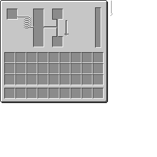

# 1.21 机器的教程

涉及到了方块实体，方块，menu，screen，capabilities，datagen，network等内容

这里会给出以前的教程帮助大家理解。然后我们就直接讲这次的代码了。

# 方块实体BlockEntity

BlockEntity的作用是实现方块的逻辑，数据的保存和读取。例如原版的熔炉，这样的具有功能的方块就是方块实体，再例如高炉，篝火，以及炼药炉都属于方块实体BlockEntitiy。

如果你做一个方块药存储数据，并且随着游戏进展会有一定的逻辑，例如熔炉烧制物品。那么你就很有可能需要到方块实体。

我们这里给出一个简单的方块实体，来说说明方块实体的各个方法作用，这里是一个方块右键后可以增加一个数字，这个数字在退出游戏会保存，进入游戏会加载。

```java
// 方块应该继承BaseEntityBlock类，表示这个类的是一个拥有方块实体的方块。
public class RubyCounter extends BaseEntityBlock {
 //
}

```

```java

// 这里我们重写了use方法，注意这个use是1.20.4的，在新的版本是useOnItem
// 这里我们是讲解原理，如果函数签名不正确还请以新版本为准。
    @Override
    public InteractionResult useOnItem(BlockState pState, Level pLevel, BlockPos pPos, Player pPlayer, InteractionHand pHand, BlockHitResult pHit) {
        if(!pLevel.isClientSide && pHand == InteractionHand.MAIN_HAND){
// 获得对应的方块的方块实体，
// 方法就是通过level.getBlockEntitiy 传入对应的位置即可。
// 会返回给你对应的位置的方块实体。
            var rubyBlockEntity = (CounterBlockEntity) pLevel.getBlockEntity(pPos);
// 我们调用了对应的方块实体提供的increase方法用于增加计数器。         
 int counter = rubyBlockEntity.increase();
            pPlayer.sendSystemMessage(Component.literal("counter:" + counter));
        }
        return InteractionResult.SUCCESS;
    }
```

此外拥有方块实体的方块可以有一些特殊的渲染效果，通过重写`getRenderShape`​方法指定。

```java
    @Override
    public RenderShape getRenderShape(BlockState pState) {
        return RenderShape.MODEL; // 这里我们还是希望直接使用正常的无方块实体对应的渲染方法。
/// 设置reandershape 为model
    }
```

以上的方法对应的方块的内容。

```java
// 这是对应的方块实体
// 方块实体 中我们要做的事情就是保存 counter
// 以及添加一个increase方法。
// 
public class CounterBlockEntity extends BlockEntity {
    private int counter = 0;
    public CounterBlockEntity(BlockPos pPos, BlockState pBlockState) {
// 构造的第一个参数是对应的注册的BlockEntityType
        super(ModBlockEntities.RUBY_COUNTER_BLOCK_ENTITY.get(), pPos, pBlockState);
    }
    public int increase(){
        counter ++; // 计数器++
        setChanged(); // 表示当前实体数据发生了变化，需要数据进行同步和保存。
        return counter;
    }
}

```

注册`BlockEntityType`​

```java
public class ModBlockEntities {
    public static final DeferredRegister<BlockEntityType<?>> BLOCK_ENTITIES =
            DeferredRegister.create(Registries.BLOCK_ENTITY_TYPE, ExampleMod.MODID);

    public static final Supplier<BlockEntityType<CounterBlockEntity>> RUBY_COUNTER_BLOCK_ENTITY =
            BLOCK_ENTITIES.register("ruby_counter_block_entity", () ->
                    BlockEntityType.Builder.of(CounterBlockEntity::new,
                            ModBlocks.RUBY_COUNTER.get()).build(null));

    public static void register(IEventBus eventBus) {
        BLOCK_ENTITIES.register(eventBus);
    }

}
```

别忘记了将用到的方块Block 和 BlockEntityType的注册添加到总线eventbus上。

你可以进入游戏了，但是你会发现者这是的counter在你退出在进入存档后，导致counter归零。

你需要重写对应的`saveAdditional`​和`loadAdditional`​方法，将对应的需要存储的counter存入到对应的nbt数据中。

[21 第一方块实体和数据保存 - Flandre923 (fuwari-ald.pages.dev)](https://fuwari-ald.pages.dev/posts/minecraft1_20_4/out_21-%E7%AC%AC%E4%B8%80%E6%96%B9%E5%9D%97%E5%AE%9E%E4%BD%93%E5%92%8C%E6%95%B0%E6%8D%AE%E4%BF%9D%E5%AD%98/)

[22 实体方块tick - Flandre923 (fuwari-ald.pages.dev)](https://fuwari-ald.pages.dev/posts/minecraft1_20_4/out_22--%E5%AE%9E%E4%BD%93%E6%96%B9%E5%9D%97tick/)

# 网络

[27 网络 - Flandre923 (fuwari-ald.pages.dev)](https://fuwari-ald.pages.dev/posts/minecraft1_20_4/out_27-%E7%BD%91%E7%BB%9C/)

# 能力

[32 构建能力 - Flandre923 (fuwari-ald.pages.dev)](https://fuwari-ald.pages.dev/posts/minecraft1_20_4/out_32-%E6%9E%84%E5%BB%BA%E8%83%BD%E5%8A%9B/)

[33 原版提供的能力ItemHander物品处理能力 - Flandre923 (fuwari-ald.pages.dev)](https://fuwari-ald.pages.dev/posts/minecraft1_20_4/out_33-%E5%8E%9F%E7%89%88%E6%8F%90%E4%BE%9B%E7%9A%84%E8%83%BD%E5%8A%9Bitemhander%E7%89%A9%E5%93%81%E5%A4%84%E7%90%86%E8%83%BD%E5%8A%9B/)

[34 能力提供附加 - Flandre923 (fuwari-ald.pages.dev)](https://fuwari-ald.pages.dev/posts/minecraft1_20_4/out_34-%E8%83%BD%E5%8A%9B%E6%8F%90%E4%BE%9B%E9%99%84%E5%8A%A0/)

# screen

[36 第一个GUI - Flandre923 (fuwari-ald.pages.dev)](https://fuwari-ald.pages.dev/posts/minecraft1_20_4/out_36-%E7%AC%AC%E4%B8%80%E4%B8%AAgui/)

[37 menu - Flandre923 (fuwari-ald.pages.dev)](https://fuwari-ald.pages.dev/posts/minecraft1_20_4/out_37-menu/)

‍

好了有了这些基础的知识后我们来看我们的1.21的内容把，这次是一个处理流体，和输入物品，输出物品的机器。有流体槽位，物品输入槽位，漏斗管道交互等内容。根据之前的教程的[Kaupenjoe](https://www.youtube.com/@ModdingByKaupenjoe)的宝石加工台改出来的。

如果你看过之前的演示视频，就知道这是一个给如合适的物品后就会源源不断的的生成蜘蛛线的方块。

先来看对应的物品的方块注册

```java
// 定义 ModBlocks 类
public class ModBlocks {
    // 创建一个延迟注册器，用于注册方块
    public static final DeferredRegister.Blocks BLOCKS = DeferredRegister.create(ForgeRegistries.BLOCKS, ExampleMod.MODID);

    // 定义一个名为 WIRE_BRUSHING_BLOCK 的延迟方块
    public static DeferredBlock<WireBrushingBlock> WIRE_BRUSHING_BLOCK = registerBlockAndItem("wire_brushing_block", () -> new WireBrushingBlock(BlockBehaviour.Properties.copy(Blocks.STONE)));

    // 注册方块和其对应的物品
    public static <T extends Block> DeferredBlock<T> registerBlockAndItem(String name, Supplier<T> block) {
        // 在延迟注册器中注册方块，并获得一个延迟方块对象
        DeferredBlock<T> deferredBlock = BLOCKS.register(name, block);
        // 在 ModItems 的 ITEMS 延迟注册器中注册物品，物品图标使用延迟方块对象，属性为默认
        ModItems.ITEMS.register(name, () -> new BlockItem(deferredBlock.get(), new Item.Properties()));
        // 返回延迟方块对象，以便在其他地方使用
        return deferredBlock;
    }

    // 注册所有已注册的方块到事件总线
    public static void register(IEventBus eventBus) {
        BLOCKS.register(eventBus);
    }
}
```

再来看对应的方块内容

```java
/**
 * WireBrushingBlock 是一个继承自 BaseEntityBlock 的类，它代表了游戏中一种特殊的方块
 * 这种方块具有特定的属性和行为，主要用于游戏中的电线刷洗功能
 * 本类是 WireBrushingBlock 的实现类，它定义了该方块的具体属性和行为细节
 */
public class WireBrushingBlock extends BaseEntityBlock {

    /**
     * 构造函数，用于初始化 WireBrushingBlock 的属性
     * 
     * @param properties 方块的属性，例如硬度、抗性等
     */
    public WireBrushingBlock(Properties properties) {
        super(properties);
    }

    /**
     * 获取当前方块的编码解码器（Codec）
     * Codec 用于序列化和反序列化方块的状态，以便在游戏世界中保存和加载
     * 由于此方块没有特殊的状态需要编码，所以返回空
     * 
     * @return 编码解码器，或者为空
     */
    @Override
    protected MapCodec<? extends BaseEntityBlock> codec() {
        return null;
    }

    /**
     * 创建一个新的方块实体（BlockEntity）
     * 当玩家在游戏中放置一个 WireBrushingBlock 时，游戏会自动创建一个对应的 WireBrushingBlockEntity
     * 这个方法负责创建这个实体，并设置它的初始状态
     * 
     * @param pos 方块的位置
     * @param state 方块的状态
     * @return 一个新的 WireBrushingBlockEntity 实例，或者为空
     */
    @Nullable
    @Override
    public BlockEntity newBlockEntity(BlockPos pos, BlockState state) {
        return new WireBrushingBlockEntity(pos, state);
    }

    /**
     * 处理玩家使用物品点击方块的交互
     * 当玩家在游戏中使用特定物品（如刷子）点击 WireBrushingBlock 时，这个方法会被调用
     * 它会检查点击的是否是客户端（防止作弊），然后尝试打开方块对应的菜单（如果有）
     * 如果方块实体（BlockEntity）缺失，会抛出一个 IllegalStateException 异常
     *
     * @param stack 玩家使用的物品堆栈
     * @param state 被点击方块的状态
     * @param level 玩家所在的游戏世界
     * @param pos 被点击方块的位置
     * @param player 进行点击操作的玩家
     * @param hand 玩家使用的手（主要用于区分左右键）
     * @param hitResult 点击的结果（包含点击的位置、方向等信息）
     * @return 返回一个 ItemInteractionResult，表示交互的结果
     */
    @Override
    protected ItemInteractionResult useItemOn(ItemStack stack, BlockState state, Level level, BlockPos pos, Player player, InteractionHand hand, BlockHitResult hitResult) {
        if (!level.isClientSide()) {
            BlockEntity blockEntity = level.getBlockEntity(pos);
            if (blockEntity instanceof WireBrushingBlockEntity wireBrushingBlockEntity) {
                player.openMenu(wireBrushingBlockEntity, pos);
            } else {
                throw new IllegalStateException("our container is missing!");
            }
        }
        return super.useItemOn(stack, state, level, pos, player, hand, hitResult);
    }

    /**
     * 获取方块的渲染形状
     * 这个方法决定了方块在游戏世界中的外观
     * 对于 WireBrushingBlock，它选择了 MODEL 渲染形状，这意味着方块将使用自定义的模型进行渲染
     *
     * @param pState 方块的当前状态
     * @return RenderShape，表示方块的渲染形状
     */
    @Override
    public RenderShape getRenderShape(BlockState pState) {
        return RenderShape.MODEL;
    }

    /**
     * 当方块被移除时的处理逻辑
     * 当 WireBrushingBlock 被破坏或被其他方块替代时，这个方法会被调用
     * 它会检查是否有对应的方块实体（BlockEntity）存在
     * 如果有，它会调用这个实体的 drops() 方法，可能是为了掉落实体中的物品或资源
     *
     * @param pState 方块被移除前的状态
     * @param pLevel 方块所在的游戏世界
     * @param pPos 方块的位置
     * @param pNewState 方块被移除后留下的状态（可能是空气或其他方块）
     * @param pIsMoving 表示方块是否因为移动而被移除（例如，被活塞推动）
     */
    @Override
    public void onRemove(BlockState pState, Level pLevel, BlockPos pPos, BlockState pNewState, boolean pIsMoving) {
        if (pState.getBlock()!= pNewState.getBlock()) {
            BlockEntity blockEntity = pLevel.getBlockEntity(pPos);
            if (blockEntity instanceof WireBrushingBlockEntity) {
                ((WireBrushingBlockEntity) blockEntity).drops();
            }
        }
        super.onRemove(pState, pLevel, pPos, pNewState, pIsMoving);
    }

    /**
     * 获取游戏世界中的计时器（Ticker），用于处理方块实体的逻辑
     * 这个方法为 WireBrushingBlockEntity 类型的方块实体设置了一个计时器
     * 这个计时器会定时调用 wireBrushingBlockEntity::tick 方法，这个方法包含了方块实体的核心逻辑
     * 返回的 BlockEntityTicker 可以被看作一个调度器，它负责安排和执行这个 tick 方法
     *
     * @param level 方块所在的游戏世界
     * @param state 方块的当前状态
     * @param type BlockEntity 的类型，即 WireBrushingBlockEntity.class
     * @return BlockEntityTicker<T> 类型的对象，用于调度方块实体的逻辑更新
     */
    @Nullable
    @Override
    public <T extends BlockEntity> BlockEntityTicker<T> getTicker(Level level, BlockState state,
                                                                  BlockEntityType<T> type) {
        return createTickerHelper(type, ModBlockEntity.WIRE_BRUSHING.get(),
                WireBrushingBlockEntity::tick);
    }
}
```

这里如果你看了上述对应的链接讲解的知识的话，那么你应该对openmenu有一定的了解，以及对应的getticker方法。如果没有这里我们再说下，openmenu就是服务端创建对应的`AbstractContainerMenu`​类的实例，在客户端创建`AbstractContainerMenu`​，以及打开对应的GUI `AbstractContainerScreen`​。

​`AbstractContainerMenu`​的作用是处理物品的交互逻辑，例如原版的熔炉，箱子等这拥有容器功能的内容。主要涉及的功能包含了定义存储的物品等内容slot槽位，监听对应的slot槽位的内容的变化，添加物品，移除物品，和客户端进行数据同步，快速移动物品等功能。

​`AbstractContainerScreen`​仅在客户端存在的类，主要用渲染容器的物品，以及其他的渲染，当然你可以渲染按钮等内容，除了这里渲染的容器的物品以外，还渲染了流体的水槽的内容。

getTicker 需要你定义你的方块的实体的执行每个tick时候的逻辑是什么，例如熔炉就是处理进度条，消耗燃料以及生成对应的燃烧后的物品。

‍

好了来看对应的方块实体的内容，首先还是注册

```java

public class ModBlockEntity {

    // 创建一个DeferredRegister实例用于注册方块实体类型
    public static DeferredRegister<BlockEntityType<?>> BLOCK_ENTITIES = DeferredRegister.create(Registries.BLOCK_ENTITY_TYPE, ExampleMod.MODID);

    // 注册一个名为"wire_brushing_block_entity"的方块实体类型
    public static final DeferredHolder<BlockEntityType<?>,BlockEntityType<WireBrushingBlockEntity>> WIRE_BRUSHING = register(
            "wire_brushing_block_entity",  () -> BlockEntityType.Builder.of(WireBrushingBlockEntity::new, ModBlocks.WIRE_BRUSHING_BLOCK.get())
    );

    // 注册方块实体类型的通用方法
    private static <T extends BlockEntity> DeferredHolder<BlockEntityType<?>, BlockEntityType<T>> register(String name, Supplier<BlockEntityType.Builder<T>> builder) {
        return BLOCK_ENTITIES.register(name,()-> builder.get().build(null));
    }

    // 注册所有方块实体类型到事件总线
    public static void register(IEventBus eventBus){
        BLOCK_ENTITIES.register(eventBus);
    }
}


```

然后来看看对应的方块实体都做了什么事情把

```java

// 电线刷洗方块实体类，实现菜单提供者接口
public class WireBrushingBlockEntity extends BlockEntity implements MenuProvider {

    // 输入槽位常量定义
    protected static final int SLOT_INPUT_WATER = 0;
    protected static final int SLOT_INPUT_BRUSHING= 1;
    protected static final int SLOT_INPUT_WIRE_HOOK = 2;
    protected final RandomSource random = RandomSource.create();

    // 物品堆处理器，用于处理物品槽位
    private final ItemStackHandler itemHandler = new ItemStackHandler(3) {
        @Override
        protected void onContentsChanged(int slot) {
            setChanged();// 标志当前方块实体数据发生了改变，当SL时候需要存储对应的的数据
        }

        @Override
        public boolean isItemValid(int slot, @NotNull ItemStack stack) {
            return switch (slot) {
                case 0-> stack.is(Items.WATER_BUCKET);
                case 1 -> stack.is(Items.TRIPWIRE_HOOK);
                case 2 -> stack.is(Items.STRING);
                default -> super.isItemValid(slot, stack);
            };
        }
    };

    // 流体罐，用于存储流体
    private final FluidTank FLUID_TANK = new FluidTank(64000) {
        @Override
        protected void onContentsChanged() {
            setChanged();
            if(!level.isClientSide()) { // 给客户端发包，用于同步对应的客户端的水槽的流体数据
                PacketDistributor.sendToAllPlayers(new FluidSyncS2CPacket(this.fluid, worldPosition));
            }
        }

        @Override
        public boolean isFluidValid(FluidStack stack) {
            return stack.getFluid() == Fluids.WATER;
        }
    };

    // 设置流体
    public void setFluid(FluidStack stack) {
        this.FLUID_TANK.setFluid(stack);
    }

    // 获取流体堆
    public FluidStack getFluidStack() {
        return this.FLUID_TANK.getFluid();
    }

    // 设置物品处理器
    public void setHandler(ItemStackHandler itemStackHandler) {
        for (int i = 0; i < itemStackHandler.getSlots(); i++) {
            itemHandler.setStackInSlot(i, itemStackHandler.getStackInSlot(i));
        }
    }

    // 获取物品处理器
    public ItemStackHandler getItemHandler(){
        return itemHandler;
    }

    // 构造函数
    public WireBrushingBlockEntity(BlockPos pos, BlockState blockState) {
        super(ModBlockEntity.WIRE_BRUSHING.get(), pos, blockState);
    }

    // 获取显示名称
    @Override
    public Component getDisplayName() { // 必须实现的方法。
        return Component.translatable("examplemod.container.wire");
    }

    // 创建菜单
    @Nullable
    @Override
    public AbstractContainerMenu createMenu(int containerId, Inventory playerInventory, Player player) {
        if (!this.getFluidStack().isEmpty()){
            PacketDistributor.sendToAllPlayers(new FluidSyncS2CPacket(this.getFluidStack(), worldPosition));
        }
        return new WireBrushingMenu(containerId, playerInventory, this);
    }


    // 掉落物品
    public void drops() {
// 当方块倍破坏时候调用这个方法。
    }

    // 方块实体的tick方法
    public static void tick(Level level, BlockPos pos, BlockState state, WireBrushingBlockEntity wireBrushingBlockEntity) {

        if(level.isClientSide()) {
            return;
        }

        if(hasRecipe(wireBrushingBlockEntity) && wireBrushingBlockEntity.random.nextFloat() < 0.1) {
            //
            BlockPos above = pos.above();

            final double x = Math.floor(above.getX()) + .25d + wireBrushingBlockEntity.random.nextDouble() * .5;
            final double y = Math.floor(above.getY()) + .25d + wireBrushingBlockEntity.random.nextDouble() * .5;
            final double z = Math.floor(above.getZ()) + .25d + wireBrushingBlockEntity.random.nextDouble() * .5;
            final double xSpeed = wireBrushingBlockEntity.random.nextDouble() * .25 - 0.125;
            final double ySpeed = wireBrushingBlockEntity.random.nextDouble() * .25 - 0.125;
            final double zSpeed = wireBrushingBlockEntity.random.nextDouble() * .25 - 0.125;
            final ItemEntity newEntity = new ItemEntity(level, x, y, z, Items.STRING.getDefaultInstance());
            newEntity.setDeltaMovement(xSpeed, ySpeed, zSpeed);
            level.addFreshEntity(newEntity);

        }

        if(hasFluidItemInSourceSlot(wireBrushingBlockEntity)) {
            transferItemFluidToFluidTank(wireBrushingBlockEntity);
        }

    }

    // 将物品槽中的流体转移到流体罐
    private static void transferItemFluidToFluidTank(WireBrushingBlockEntity pEntity) {
        Optional.ofNullable(pEntity.itemHandler.getStackInSlot(0).getCapability(Capabilities.FluidHandler.ITEM)).ifPresent(handler -> {
            int drainAmount = Math.min(pEntity.FLUID_TANK.getSpace(), 1000);

            FluidStack stack = handler.drain(drainAmount, IFluidHandler.FluidAction.SIMULATE);
            if(pEntity.FLUID_TANK.isFluidValid(stack)) {
                stack = handler.drain(drainAmount, IFluidHandler.FluidAction.EXECUTE);
                fillTankWithFluid(pEntity, stack, handler.getContainer());
            }
        });
    }

    // 填充流体罐
    private static void fillTankWithFluid(WireBrushingBlockEntity pEntity, FluidStack stack, ItemStack container) {
        pEntity.FLUID_TANK.fill(stack, IFluidHandler.FluidAction.EXECUTE);
        pEntity.itemHandler.extractItem(0, 1, false);
        pEntity.itemHandler.insertItem(0, container, false);
    }

    // 检查源槽中是否有流体物品
    private static boolean hasFluidItemInSourceSlot(WireBrushingBlockEntity pEntity) {
        return pEntity.itemHandler.getStackInSlot(0).getCount() > 0;
    }

    // 检查是否有配方
    private static boolean hasRecipe(WireBrushingBlockEntity entity) {
        SimpleContainer inventory = new SimpleContainer(entity.itemHandler.getSlots());
        for (int i = 0; i < entity.itemHandler.getSlots(); i++) {
            inventory.setItem(i, entity.itemHandler.getStackInSlot(i));
        }

        if (inventory.getContainerSize() < 3){
            return false;
        }

        if (inventory.getItem(2).is(Items.STRING) && inventory.getItem(2).getCount() > 2 && inventory.getItem(1).is(Items.TRIPWIRE_HOOK)
        && inventory.getItem(1).getCount() > 2 && hasCorrectFluidAmountInTank(entity)){
            return true;
        }
         return false;
    }

    // 检查流体罐中是否有正确的流体量
    private static boolean hasCorrectFluidAmountInTank(WireBrushingBlockEntity entity) {
        return entity.FLUID_TANK.getFluidAmount() >= 2000;
    }

    // 保存额外数据
    @Override
    protected void saveAdditional(CompoundTag tag, HolderLookup.Provider registries) {
        tag.put("inventory", itemHandler.serializeNBT(registries));
        tag = FLUID_TANK.writeToNBT(registries,tag);
        super.saveAdditional(tag, registries);
    }

    // 加载额外数据
    @Override
    protected void loadAdditional(CompoundTag tag, HolderLookup.Provider registries) {
        itemHandler.deserializeNBT(registries,tag.getCompound("inventory"));
        FLUID_TANK.readFromNBT(registries,tag);
        super.loadAdditional(tag, registries);
    }
}


```

这里涉及到检查流体的和物品是否合法，如果合法，则不断生成线，如果不合法，就不执行操作。如果在0slot中放入了水桶，那么就增加fluidtank的量，并删除水桶。

这里还涉及到了网络的发包，这里发包是给所有的玩家发包，用于同步同步对应的流体的数据。以及涉及到了对应的menu，我们先来对应的menu以及screen

首先还是MenuType的注册，这没什么好说的了，直接照着写就好了。

```java

public class ModMenuTypes {
    public static DeferredRegister<MenuType<?>> MENU_TYPES =
            DeferredRegister.create(Registries.MENU, ExampleMod.MODID);
	// 注册MenuType
    public static final DeferredHolder<MenuType<?>,MenuType<WireBrushingMenu>> WIRE_BRUSHING_MENU =
            registerMenuType(WireBrushingMenu::new, "wire_brushing_menu");

    private static <T extends AbstractContainerMenu>
            DeferredHolder<MenuType<?>,MenuType<T>> registerMenuType(IContainerFactory<T> factory, String name)
    {
        return MENU_TYPES.register(name, () -> IMenuTypeExtension.create(factory));
    }

    public static void register(IEventBus eventBus) {
        MENU_TYPES.register(eventBus);
    }
}

```

然后是对应的menu

```java
// WireBrushingMenu类继承自AbstractContainerMenu，用于实现电线刷洗菜单的功能
public class WireBrushingMenu extends AbstractContainerMenu {
    // 定义WireBrushingBlockEntity实例，表示方块实体
    public final WireBrushingBlockEntity blockEntity;
    // 定义Level实例，表示游戏关卡
    private final Level level;
    // 定义FluidStack实例，表示流体堆栈
    private FluidStack fluidStack;

    // 构造函数，通过容器ID、玩家库存和额外数据创建WireBrushingMenu实例
    public WireBrushingMenu(int containerId, Inventory playerInv, FriendlyByteBuf extraData) {
        this(containerId,playerInv,playerInv.player.level().getBlockEntity(extraData.readBlockPos()));
    }

    // 构造函数，通过ID、库存和方块实体创建WireBrushingMenu实例
    public WireBrushingMenu(int id, Inventory inv, BlockEntity entity) {
        super(ModMenuTypes.WIRE_BRUSHING_MENU.get(), id);
        checkContainerSize(inv, 3);
        blockEntity = (WireBrushingBlockEntity) entity;
        this.level = inv.player.level();
        this.fluidStack = blockEntity.getFluidStack();

        addPlayerInventory(inv);
        addPlayerHotbar(inv);

        ItemStackHandler itemHandler = this.blockEntity.getItemHandler();

        this.addSlot(new SlotItemHandler(itemHandler, 0, 12, 15));
        this.addSlot(new SlotItemHandler(itemHandler, 1, 86, 15));
        this.addSlot(new SlotItemHandler(itemHandler, 2, 86, 60));

//        addDataSlots(data);
    }

    // 快速移动物品堆栈的方法
    @Override
    public ItemStack quickMoveStack(Player player, int index) {
        return ItemStack.EMPTY;
    }

    // 判断菜单是否仍然有效的方法
    @Override
    public boolean stillValid(Player player) {
        return true; // 根据自己的逻辑是否返回true
    }

    // 添加玩家库存的方法
    private void addPlayerInventory(Inventory playerInventory) {
        for (int i = 0; i < 3; ++i) {
            for (int l = 0; l < 9; ++l) {
                this.addSlot(new Slot(playerInventory, l + i * 9 + 9, 8 + l * 18, 86 + i * 18));
            }
        }
    }

    // 添加玩家快捷栏的方法
    private void addPlayerHotbar(Inventory playerInventory) {
        for (int i = 0; i < 9; ++i) {
            this.addSlot(new Slot(playerInventory, i, 8 + i * 18, 144));
        }
    }

    // 获取流体堆栈的方法
    public FluidStack getFluidStack() {
        return blockEntity.getFluidStack();
    }

    // 获取方块实体的方法
    public BlockEntity getBlockEntity() {
        return blockEntity;
    }

    // 设置流体的方法
    public void setFluid(FluidStack fluid) {
        this.fluidStack = fluid;
    }
}

```

下面是对应的screen的方法

```java
// WireBrushingScreen类继承自AbstractContainerScreen，用于实现电线刷洗屏幕的GUI
public class WireBrushingScreen extends AbstractContainerScreen<WireBrushingMenu> {

    private static final ResourceLocation TEXTURE =
            ResourceLocation.fromNamespaceAndPath(ExampleMod.MODID, "textures/gui/gem_infusing_station_gui.png");

    private FluidTankRenderer renderer;

    // 构造方法，初始化WireBrushingScreen
    public WireBrushingScreen(WireBrushingMenu menu, Inventory playerInventory, Component title) {
        super(menu, playerInventory, title);
    }

    // 初始化方法，调用父类init并分配能量信息区域和流体渲染器
    @Override
    protected void init() {
        super.init();
        assignFluidRenderer();
    }

    // 分配流体渲染器
    private void assignFluidRenderer() {
        renderer = new FluidTankRenderer(64000, true, 16, 61);
    }

    // 渲染标签方法
    @Override
    protected void renderLabels(GuiGraphics guiGraphics, int pMouseX, int pMouseY) {
        super.renderLabels(guiGraphics, pMouseX, pMouseY);
        int x = (width - imageWidth) / 2;
        int y = (height - imageHeight) / 2;

        renderFluidAreaTooltips(guiGraphics, pMouseX, pMouseY, x, y);

    }

    // 渲染流体区域工具提示
    private void renderFluidAreaTooltips(GuiGraphics guiGraphics, int pMouseX, int pMouseY, int x, int y) {
        if (isMouseAboveArea(pMouseX, pMouseY, x, y, 55, 15)) {
            guiGraphics.renderTooltip(this.font,renderer.getTooltip(menu.getFluidStack(), TooltipFlag.Default.NORMAL),
                    Optional.empty(), pMouseX - x, pMouseY - y);
        }
    }

    // 渲染背景方法
    @Override
    protected void renderBg(GuiGraphics guiGraphics, float partialTick, int mouseX, int mouseY) {

        RenderSystem.setShader(GameRenderer::getPositionTexShader);
        RenderSystem.setShaderColor(1.0F, 1.0F, 1.0F, 1.0F);
        RenderSystem.setShaderTexture(0, TEXTURE);
        int x = (width - imageWidth) / 2;
        int y = (height - imageHeight) / 2;

        guiGraphics.blit(TEXTURE,x, y, 0, 0, imageWidth, imageHeight);


        renderer.render(guiGraphics, x + 55, y + 15, menu.getFluidStack());
    }

    // 判断鼠标是否在指定区域上方
    private boolean isMouseAboveArea(int pMouseX, int pMouseY, int x, int y, int offsetX, int offsetY, int width, int height) {
        return MouseUtil.isMouseOver(pMouseX, pMouseY, x + offsetX, y + offsetY, width, height);
    }

    // 判断鼠标是否在指定区域上方（重载方法）
    private boolean isMouseAboveArea(int pMouseX, int pMouseY, int x, int y, int offsetX, int offsetY) {
        return MouseUtil.isMouseOver(pMouseX, pMouseY, x + offsetX, y + offsetY, renderer.getWidth(), renderer.getHeight());
    }


    // 渲染方法
    @Override
    public void render(GuiGraphics guiGraphics, int mouseX, int mouseY, float partialTick) {
        renderBg(guiGraphics, partialTick, mouseX, mouseY);
        super.render(guiGraphics, mouseX, mouseY, partialTick);
        renderTooltip(guiGraphics, mouseX, mouseY);
    }
}

```

在这渲染中，用到了一些其他的方法，首先是背景图的绘制在renderbg中，然后对应的物品的提示，流体水槽的提示在label中，我们重写了render，确保先渲染背景，在渲染物品，然后再渲染提示信息。

这里用到了一些辅助的方法，首先是绘制对应的水槽的流体的渲染，这部分的内容来自JEI。稍后我们会看到具体的方法。

然后还有一个辅助的方法是判断当前的鼠标的位置是否再指定的区域中。如果在水槽的区域中，绘制当前的水槽有多少的水以及还有多少的容量。先来看这部分的代码：

```java
// MouseUtil类提供了一系列用于判断鼠标是否悬停在指定区域的方法
public class MouseUtil {
    // 判断鼠标是否悬停在指定位置的默认大小区域（16x16）
    public static boolean isMouseOver(double mouseX, double mouseY, int x, int y) {
        return isMouseOver(mouseX, mouseY, x, y, 16);
    }

    // 判断鼠标是否悬停在指定位置和指定大小的区域
    public static boolean isMouseOver(double mouseX, double mouseY, int x, int y, int size) {
        return isMouseOver(mouseX, mouseY, x, y, size, size);
    }

    // 判断鼠标是否悬停在指定位置和指定大小的矩形区域
    public static boolean isMouseOver(double mouseX, double mouseY, int x, int y, int sizeX, int sizeY) {
        return (mouseX >= x && mouseX <= x + sizeX) && (mouseY >= y && mouseY <= y + sizeY);
    }
}

```

逻辑比较简单，就留给大家自己试了。

我们主要来看下JEI的流体的渲染是怎么做的，`FluidTankRenderer`​,先来总体看下代码

```java
public class FluidTankRenderer {
    // 日志记录器
    private static final Logger LOGGER = LogManager.getLogger();

    // 数字格式化器
    private static final NumberFormat nf = NumberFormat.getIntegerInstance();
    // 纹理尺寸
    private static final int TEXTURE_SIZE = 16;
    // 最小流体高度，确保少量流体仍然可见
    private static final int MIN_FLUID_HEIGHT = 1;

    // 流体罐容量
    private final long capacity;
    // 工具提示模式
    private final TooltipMode tooltipMode;
    // 渲染宽度
    private final int width;
    // 渲染高度
    private final int height;

    // 工具提示模式枚举
    enum TooltipMode {
        SHOW_AMOUNT, // 显示数量
        SHOW_AMOUNT_AND_CAPACITY, // 显示数量和容量
        ITEM_LIST // 显示物品列表
    }

    // 构造函数，根据是否显示容量初始化工具提示模式
    public FluidTankRenderer(long capacity, boolean showCapacity, int width, int height) {
        this(capacity, showCapacity ? TooltipMode.SHOW_AMOUNT_AND_CAPACITY : TooltipMode.SHOW_AMOUNT, width, height);
    }

    // 私有构造函数，用于初始化流体罐渲染器
    private FluidTankRenderer(long capacity, TooltipMode tooltipMode, int width, int height) {
        Preconditions.checkArgument(capacity > 0, "capacity must be > 0");
        Preconditions.checkArgument(width > 0, "width must be > 0");
        Preconditions.checkArgument(height > 0, "height must be > 0");

        this.capacity = capacity;
        this.tooltipMode = tooltipMode;
        this.width = width;
        this.height = height;
    }

    // 渲染流体罐
    public void render(GuiGraphics guiGraphics, int x, int y, FluidStack fluidStack) {
        RenderSystem.enableBlend();
        guiGraphics.pose().pushPose();
        {
            guiGraphics.pose().translate(x, y, 0);
            drawFluid(guiGraphics.pose(), width, height, fluidStack);
        }
        guiGraphics.pose().popPose();
        RenderSystem.setShaderColor(1, 1, 1, 1);
        RenderSystem.disableBlend();
    }

    // 绘制流体
    private void drawFluid(PoseStack poseStack, final int width, final int height, FluidStack fluidStack) {
        Fluid fluid = fluidStack.getFluid();
        if (fluid.isSame(Fluids.EMPTY)) {
            return;
        }

        TextureAtlasSprite fluidStillSprite = getStillFluidSprite(fluidStack);
        int fluidColor = getColorTint(fluidStack);

        long amount = fluidStack.getAmount();
        long scaledAmount = (amount * height) / capacity;

        if (amount > 0 && scaledAmount < MIN_FLUID_HEIGHT) {
            scaledAmount = MIN_FLUID_HEIGHT;
        }
        if (scaledAmount > height) {
            scaledAmount = height;
        }

        drawTiledSprite(poseStack, width, height, fluidColor, scaledAmount, fluidStillSprite);
    }

    // 获取流体静止纹理
    private TextureAtlasSprite getStillFluidSprite(FluidStack fluidStack) {
        Fluid fluid = fluidStack.getFluid();
        IClientFluidTypeExtensions renderProperties = IClientFluidTypeExtensions.of(fluid);
        ResourceLocation fluidStill = renderProperties.getStillTexture(fluidStack);

        Minecraft minecraft = Minecraft.getInstance();
        return minecraft.getTextureAtlas(InventoryMenu.BLOCK_ATLAS).apply(fluidStill);
    }

    // 获取流体颜色
    private int getColorTint(FluidStack ingredient) {
        Fluid fluid = ingredient.getFluid();
        IClientFluidTypeExtensions renderProperties = IClientFluidTypeExtensions.of(fluid);
        return renderProperties.getTintColor(ingredient);
    }

    // 绘制平铺纹理
    private static void drawTiledSprite(PoseStack poseStack, final int tiledWidth, final int tiledHeight, int color, long scaledAmount, TextureAtlasSprite sprite) {
        RenderSystem.setShaderTexture(0, InventoryMenu.BLOCK_ATLAS);
        Matrix4f matrix = poseStack.last().pose();
        setGLColorFromInt(color);

        final int xTileCount = tiledWidth / TEXTURE_SIZE;
        final int xRemainder = tiledWidth - (xTileCount * TEXTURE_SIZE);
        final long yTileCount = scaledAmount / TEXTURE_SIZE;
        final long yRemainder = scaledAmount - (yTileCount * TEXTURE_SIZE);

        final int yStart = tiledHeight;

        for (int xTile = 0; xTile <= xTileCount; xTile++) {
            for (int yTile = 0; yTile <= yTileCount; yTile++) {
                int width = (xTile == xTileCount) ? xRemainder : TEXTURE_SIZE;
                long height = (yTile == yTileCount) ? yRemainder : TEXTURE_SIZE;
                int x = (xTile * TEXTURE_SIZE);
                int y = yStart - ((yTile + 1) * TEXTURE_SIZE);
                if (width > 0 && height > 0) {
                    long maskTop = TEXTURE_SIZE - height;
                    int maskRight = TEXTURE_SIZE - width;

                    drawTextureWithMasking(matrix, x, y, sprite, maskTop, maskRight, 100);
                }
            }
        }
    }

    // 从整数设置GL颜色
    private static void setGLColorFromInt(int color) {
        float red = (color >> 16 & 0xFF) / 255.0F;
        float green = (color >> 8 & 0xFF) / 255.0F;
        float blue = (color & 0xFF) / 255.0F;
        float alpha = ((color >> 24) & 0xFF) / 255F;

        RenderSystem.setShaderColor(red, green, blue, alpha);
    }

    // 使用遮罩绘制纹理
    private static void drawTextureWithMasking(Matrix4f matrix, float xCoord, float yCoord, TextureAtlasSprite textureSprite, long maskTop, long maskRight, float zLevel) {
        float uMin = textureSprite.getU0();
        float uMax = textureSprite.getU1();
        float vMin = textureSprite.getV0();
        float vMax = textureSprite.getV1();
        uMax = uMax - (maskRight / 16F * (uMax - uMin));
        vMax = vMax - (maskTop / 16F * (vMax - vMin));

        RenderSystem.setShader(GameRenderer::getPositionTexShader);

        Tesselator tesselator = Tesselator.getInstance();
        BufferBuilder bufferBuilder = tesselator.begin(VertexFormat.Mode.QUADS, DefaultVertexFormat.POSITION_TEX);
        bufferBuilder.addVertex(matrix, xCoord, yCoord + 16, zLevel).setUv(uMin, vMax);
        bufferBuilder.addVertex(matrix, xCoord + 16 - maskRight, yCoord + 16, zLevel).setUv(uMax, vMax);
        bufferBuilder.addVertex(matrix, xCoord + 16 - maskRight, yCoord + maskTop, zLevel).setUv(uMax, vMin);
        bufferBuilder.addVertex(matrix, xCoord, yCoord + maskTop, zLevel).setUv(uMin, vMin);
        BufferUploader.drawWithShader(bufferBuilder.buildOrThrow());
    }

    // 获取工具提示
    public List<Component> getTooltip(FluidStack fluidStack, TooltipFlag tooltipFlag) {
        List<Component> tooltip = new ArrayList<>();

        Fluid fluidType = fluidStack.getFluid();
        try {
            if (fluidType.isSame(Fluids.EMPTY)) {
                return tooltip;
            }

            Component displayName = fluidStack.getHoverName();
            tooltip.add(displayName);

            long amount = fluidStack.getAmount();
            long milliBuckets = (amount * 1000) / FluidType.BUCKET_VOLUME;

            if (tooltipMode == TooltipMode.SHOW_AMOUNT_AND_CAPACITY) {
                MutableComponent amountString = Component.translatable("tutorialmod.tooltip.liquid.amount.with.capacity", nf.format(milliBuckets), nf.format(capacity));
                tooltip.add(amountString.withStyle(ChatFormatting.GRAY));
            } else if (tooltipMode == TooltipMode.SHOW_AMOUNT) {
                MutableComponent amountString = Component.translatable("tutorialmod.tooltip.liquid.amount", nf.format(milliBuckets));
                tooltip.add(amountString.withStyle(ChatFormatting.GRAY));
            }
        } catch (RuntimeException e) {
            LOGGER.error("Failed to get tooltip for fluid: " + e);
        }

        return tooltip;
    }

    // 获取渲染宽度
    public int getWidth() {
        return width;
    }

    // 获取渲染高度
    public int getHeight() {
        return height;
    }
}

```

然后我们按照render的流程看下对应的内容

由对应的screen的renderbg方法调用对应的`FluidTankRenderer`​的render

```java
    @Override
    protected void renderBg(GuiGraphics guiGraphics, float partialTick, int mouseX, int mouseY) {

        RenderSystem.setShader(GameRenderer::getPositionTexShader);
        RenderSystem.setShaderColor(1.0F, 1.0F, 1.0F, 1.0F);
        RenderSystem.setShaderTexture(0, TEXTURE);
        int x = (width - imageWidth) / 2;
        int y = (height - imageHeight) / 2;

        guiGraphics.blit(TEXTURE,x, y, 0, 0, imageWidth, imageHeight);

        renderProgressArrow(guiGraphics, x, y);
//        energyInfoArea.draw(guiGraphics);
        renderer.render(guiGraphics, x + 55, y + 15, menu.getFluidStack()); // 这里会调用`FluidTankRenderer`的render
    }

```

FluidTankRenderer

```java
    public void render(GuiGraphics guiGraphics, int x, int y, FluidStack fluidStack) { // 
        RenderSystem.enableBlend(); // 开启混合
        guiGraphics.pose().pushPose();
        {
            guiGraphics.pose().translate(x, y, 0); // 渲染的x，y位置。
            drawFluid(guiGraphics.pose(), width, height, fluidStack); // 渲染流体
        }
        guiGraphics.pose().popPose(); // 恢复posestack
        RenderSystem.setShaderColor(1, 1, 1, 1); // 重置
        RenderSystem.disableBlend(); // 关闭混合
    }
```

```java

// FluidTankRenderer
    private void drawFluid(PoseStack poseStack, final int width, final int height, FluidStack fluidStack) {
        Fluid fluid = fluidStack.getFluid(); // 获得对应的流体
        if (fluid.isSame(Fluids.EMPTY)) { // 如果流体是空
            return;
        }

        TextureAtlasSprite fluidStillSprite = getStillFluidSprite(fluidStack); // 获得流体对应的纹理图片
        int fluidColor = getColorTint(fluidStack); // 获得流体对应的颜色。

        long amount = fluidStack.getAmount(); // 获得容量
        long scaledAmount = (amount * height) / capacity; // 要渲染的高度

        if (amount > 0 && scaledAmount < MIN_FLUID_HEIGHT) { // 
            scaledAmount = MIN_FLUID_HEIGHT; // 过少，就渲染最小的高度
        }
        if (scaledAmount > height) {
            scaledAmount = height; // 超出高度渲染为最大高度
        }
 		// 调用drawTiledSprite渲染。
        drawTiledSprite(poseStack, width, height, fluidColor, scaledAmount, fluidStillSprite);
    }
```

```java
 // fluidTankRenderer
    private static void drawTiledSprite(PoseStack poseStack, final int tiledWidth, final int tiledHeight, int color, long scaledAmount, TextureAtlasSprite sprite) {
        RenderSystem.setShaderTexture(0, InventoryMenu.BLOCK_ATLAS); // 设置渲染的纹理图片
        Matrix4f matrix = poseStack.last().pose(); // 获得变换矩阵
        setGLColorFromInt(color);// 设置渲染的color

        final int xTileCount = tiledWidth / TEXTURE_SIZE;
        final int xRemainder = tiledWidth - (xTileCount * TEXTURE_SIZE);
        final long yTileCount = scaledAmount / TEXTURE_SIZE;
        final long yRemainder = scaledAmount - (yTileCount * TEXTURE_SIZE);

        final int yStart = tiledHeight;

        for (int xTile = 0; xTile <= xTileCount; xTile++) { // 这里是按照横着和竖着的瓦片的数量绘制的，
            for (int yTile = 0; yTile <= yTileCount; yTile++) { // 如果不够一个瓦片的大小就按照一个瓦片算。
                int width = (xTile == xTileCount) ? xRemainder : TEXTURE_SIZE;
                long height = (yTile == yTileCount) ? yRemainder : TEXTURE_SIZE;
                int x = (xTile * TEXTURE_SIZE);
                int y = yStart - ((yTile + 1) * TEXTURE_SIZE);
                if (width > 0 && height > 0) {
                    long maskTop = TEXTURE_SIZE - height;
                    int maskRight = TEXTURE_SIZE - width;

                    drawTextureWithMasking(matrix, x, y, sprite, maskTop, maskRight, 100);
                }
            }
        }
    }
```

```java
// fluidTankRenderer
    private static void drawTextureWithMasking(Matrix4f matrix, float xCoord, float yCoord, TextureAtlasSprite textureSprite, long maskTop, long maskRight, float zLevel) {
        float uMin = textureSprite.getU0();
        float uMax = textureSprite.getU1();
        float vMin = textureSprite.getV0();
        float vMax = textureSprite.getV1();
        uMax = uMax - (maskRight / 16F * (uMax - uMin));
        vMax = vMax - (maskTop / 16F * (vMax - vMin));

        RenderSystem.setShader(GameRenderer::getPositionTexShader);

        Tesselator tesselator = Tesselator.getInstance();
        BufferBuilder bufferBuilder = tesselator.begin(VertexFormat.Mode.QUADS, DefaultVertexFormat.POSITION_TEX);
        bufferBuilder.addVertex(matrix, xCoord, yCoord + 16, zLevel).setUv(uMin, vMax);
        bufferBuilder.addVertex(matrix, xCoord + 16 - maskRight, yCoord + 16, zLevel).setUv(uMax, vMax);
        bufferBuilder.addVertex(matrix, xCoord + 16 - maskRight, yCoord + maskTop, zLevel).setUv(uMax, vMin);
        bufferBuilder.addVertex(matrix, xCoord, yCoord + maskTop, zLevel).setUv(uMin, vMin);
        BufferUploader.drawWithShader(bufferBuilder.buildOrThrow());
    }

```

到这里就彻底绘制完毕了对应的流体。我们将对应的menu和screen绑定在一起。

```java
@EventBusSubscriber(modid = ExampleMod.MODID, bus = EventBusSubscriber.Bus.MOD, value = Dist.CLIENT)
public class ScreenRegistries
{
    @SubscribeEvent
    public static void onClientSetup(RegisterMenuScreensEvent event)
    {
        // scrren
        event.register(ModMenuTypes.WIRE_BRUSHING_MENU.get(), WireBrushingScreen::new);
    }
}
```

下面我们看对应的能力。

```java
@EventBusSubscriber(modid = ExampleMod.MODID,bus = EventBusSubscriber.Bus.MOD)
public class ModCapabilities {

    @SubscribeEvent
    public static void registerCapabilities(RegisterCapabilitiesEvent event) {
        event.registerBlockEntity(Capabilities.ItemHandler.BLOCK,
                ModBlockEntity.WIRE_BRUSHING.get(),
                (blockEntity,side)->{
                    return blockEntity.getItemHandler();
                });
    }
}
// 我们给对应的实体注册能力，将我们的ItemHandler返回即可，如果你要处理不同的面对于输入的物品不一样那么自己对side进行判断。


```

然后就是发包的内容。

```java

public class FluidSyncS2CPacket implements CustomPacketPayload {

    public FluidStack fluid;
    public BlockPos worldPos;

    public static final StreamCodec<RegistryFriendlyByteBuf,FluidSyncS2CPacket> STREAM_CODEC =
            CustomPacketPayload.codec(FluidSyncS2CPacket::encode,FluidSyncS2CPacket::new);

    public static final CustomPacketPayload.Type<FluidSyncS2CPacket> TYPE =
            new CustomPacketPayload.Type<>(ResourceLocation.fromNamespaceAndPath(ExampleMod.MODID,"thirst_data"));

    public FluidSyncS2CPacket(RegistryFriendlyByteBuf buf) {
        this.worldPos = buf.readBlockPos();
        this.fluid = FluidStack.STREAM_CODEC.decode(buf);
    }

    public FluidSyncS2CPacket( FluidStack fluid,BlockPos pos) {
        this.fluid = fluid;
        this.worldPos = pos;
    }

    private void encode(RegistryFriendlyByteBuf buf) {
        buf.writeBlockPos(this.worldPos);
        FluidStack.STREAM_CODEC.encode(buf,this.fluid);
    }

    public static void handle(final FluidSyncS2CPacket data, final IPayloadContext context) {
        context.enqueueWork(() -> {
            if(Minecraft.getInstance().level.getBlockEntity(data.worldPos) instanceof WireBrushingBlockEntity blockEntity) {
                blockEntity.setFluid(data.fluid);

                if(Minecraft.getInstance().player.containerMenu instanceof WireBrushingMenu menu &&
                        menu.getBlockEntity().getBlockPos().equals(data.worldPos)) {
                    menu.setFluid(data.fluid);
                }
            }
        });
    }
    @Override
    public Type<? extends CustomPacketPayload> type() {
        return TYPE;
    }
}

```

我们需要同步的是fluidstack，这里的pos是我们用于获取对应的方块实体用的位置。

```java

@EventBusSubscriber(modid = ExampleMod.MODID,bus = EventBusSubscriber.Bus.MOD)
public class ModMessage {
    @SubscribeEvent
    public static void register(final RegisterPayloadHandlersEvent event) {

        final PayloadRegistrar registrar = event.registrar(ExampleMod.MODID);
        registrar.playBidirectional(
                FluidSyncS2CPacket.TYPE,
                FluidSyncS2CPacket.STREAM_CODEC,
                new DirectionalPayloadHandler<>(
                        FluidSyncS2CPacket::handle,
                        null
                )
        );

    }
}
```

这是对应的网络包的注册。

最后是语言化的问题，我们回到我们的渲染的水槽的提示哪里。我们需要对文本进行格式化，对应的是下面的内容，%s 表示使用string类型的内容格式化文本，所以，这里的%s，会被传入文本内容替换。

```json
{
  "tutorialmod.tooltip.liquid.amount": "%s mB",
  "tutorialmod.tooltip.liquid.amount.with.capacity": "%s / %s mB"
}
```

对应的内容在FluidTankRenderer中

```java
       if (tooltipMode == TooltipMode.SHOW_AMOUNT_AND_CAPACITY) {
// 将对应的数字转为String，并格式化文本。
                MutableComponent amountString = Component.translatable("tutorialmod.tooltip.liquid.amount.with.capacity", nf.format(milliBuckets), nf.format(capacity));
                tooltip.add(amountString.withStyle(ChatFormatting.GRAY));
            } else if (tooltipMode == TooltipMode.SHOW_AMOUNT) {
                MutableComponent amountString = Component.translatable("tutorialmod.tooltip.liquid.amount", nf.format(milliBuckets));
                tooltip.add(amountString.withStyle(ChatFormatting.GRAY));
            }
```

记得将你的GUI放在对应的位置

​​
