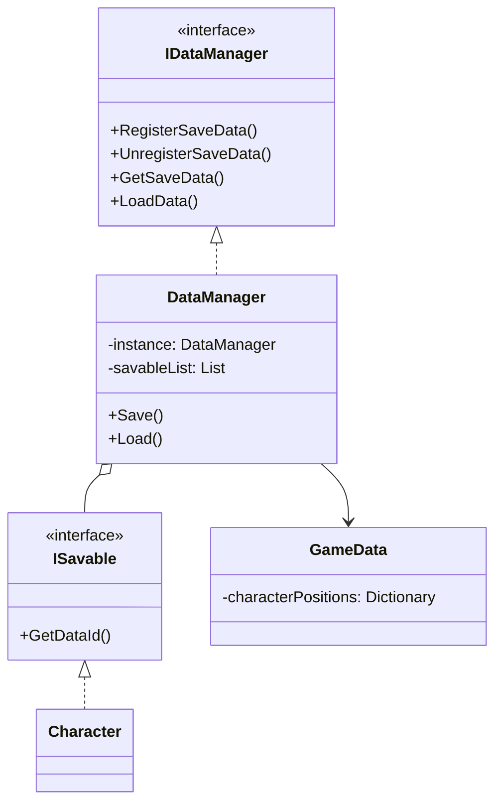

在Unity中构建一个灵活、可扩展的游戏数据存储与加载系统。这个系统将帮助你保存和恢复游戏中的各种状态，从玩家位置到敌人状态，甚至是场景中的交互对象。

## 1. 系统架构概述

我们的数据存储系统将采用以下设计模式：

* **观察者模式**：通过接口通知需要保存的对象
* **单例模式**：确保数据管理器全局唯一
* **命令模式**：统一处理保存和加载操作



## 2. 核心接口设计

### 2.1 ISavable接口

首先创建基础接口，定义所有可保存对象必须实现的方法：

```csharp
public interface ISavable
{
    // 注册/注销方法
    void RegisterSaveData() => DataManager.Instance.RegisterSaveData(this);
    void UnregisterSaveData() => DataManager.Instance.UnregisterSaveData(this);
  
    // 数据操作方法
    string GetDataId();
    void GetSaveData(GameData data);
    void LoadData(GameData data);
}
```

### 2.2 数据容器类

设计一个专门用于存储游戏数据的类：

```csharp
[System.Serializable]
public class GameData
{
    public Dictionary<string, Vector3> characterPositions = new();
    // 可以扩展其他需要保存的数据类型
}
```

## 3. 数据管理器实现

### 3.1 单例模式实现

```csharp
public class DataManager : MonoBehaviour
{
    public static DataManager Instance { get; private set; }
  
    private List<ISavable> savableList = new();
    private GameData currentData = new();
  
    private void Awake()
    {
        if (Instance == null)
        {
            Instance = this;
            DontDestroyOnLoad(gameObject);
        }
        else
        {
            Destroy(gameObject);
        }
    }
}
```

### 3.2 注册与注销方法

```csharp
public void RegisterSaveData(ISavable savable)
{
    if (!savableList.Contains(savable))
    {
        savableList.Add(savable);
    }
}

public void UnregisterSaveData(ISavable savable)
{
    savableList.Remove(savable);
}
```

## 4. 唯一标识系统

为了解决场景中同名对象的区分问题，我们实现一个唯一ID生成器：

```csharp
public class DataDefinition : MonoBehaviour
{
    public enum PersistentType { ReadAndWrite, DoNotPersist }
  
    [SerializeField] private PersistentType persistenceType = PersistentType.ReadAndWrite;
    [SerializeField] private string id;
  
    public string Id => id;
  
    private void OnValidate()
    {
        if (persistenceType == PersistentType.ReadAndWrite && string.IsNullOrEmpty(id))
        {
            id = System.Guid.NewGuid().ToString();
        }
        else if (persistenceType == PersistentType.DoNotPersist)
        {
            id = string.Empty;
        }
    }
}
```

## 5. 具体实现示例 - 角色数据保存

以角色(Character)类为例，展示如何实现ISavable接口：

```csharp
public class Character : MonoBehaviour, ISavable
{
    private DataDefinition dataDefinition;
  
    private void Awake()
    {
        dataDefinition = GetComponent<DataDefinition>();
        RegisterSaveData();
    }
  
    private void OnDestroy()
    {
        UnregisterSaveData();
    }
  
    public string GetDataId() => dataDefinition.Id;
  
    public void GetSaveData(GameData data)
    {
        if (data.characterPositions.ContainsKey(GetDataId()))
        {
            data.characterPositions[GetDataId()] = transform.position;
        }
        else
        {
            data.characterPositions.Add(GetDataId(), transform.position);
        }
    }
  
    public void LoadData(GameData data)
    {
        if (data.characterPositions.TryGetValue(GetDataId(), out Vector3 position))
        {
            transform.position = position;
        }
    }
}
```

## 6. 保存与加载流程

### 6.1 保存游戏数据

```csharp
public void SaveGame()
{
    // 重置当前数据
    currentData = new GameData();
  
    // 收集所有需要保存的数据
    foreach (var savable in savableList)
    {
        savable.GetSaveData(currentData);
    }
  
    // 打印调试信息
    foreach (var item in currentData.characterPositions)
    {
        Debug.Log($"Saved: {item.Key} - {item.Value}");
    }
  
    // 实际存储到文件（后续实现）
    // string jsonData = JsonUtility.ToJson(currentData);
    // File.WriteAllText(savePath, jsonData);
}
```

### 6.2 加载游戏数据

```csharp
public void LoadGame()
{
    // 从文件读取数据（后续实现）
    // if (File.Exists(savePath))
    // {
    //     string jsonData = File.ReadAllText(savePath);
    //     currentData = JsonUtility.FromJson<GameData>(jsonData);
    // }
  
    // 应用加载的数据
    foreach (var savable in savableList)
    {
        savable.LoadData(currentData);
    }
}
```

## 7. 测试与调试

为了方便测试，我们可以添加简单的键盘控制：

```csharp
private void Update()
{
    // 使用新的Input System检测按键
    if (Keyboard.current.lKey.wasPressedThisFrame)
    {
        LoadGame();
    }
  
    if (Keyboard.current.sKey.wasPressedThisFrame)
    {
        SaveGame();
    }
}
```

## 8. 系统扩展思路

这个基础系统可以进一步扩展：

1. **更多数据类型支持**：添加血量、任务状态等
2. **场景状态保存**：记录场景中物体的激活状态
3. **二进制/加密存储**：提高安全性和性能
4. **多存档槽位**：支持多个存档文件
5. **云存储集成**：实现跨设备同步

## 9. 常见问题解决

**Q: 为什么预制体生成的敌人ID都一样？**

A: 需要在场景中为每个实例重新生成唯一ID：

1. 选择场景中的敌人实例
2. 将DataDefinition的PersistentType改为DoNotPersist
3. 再改回ReadAndWrite生成新ID

## 10. 总结

通过本教程，我们实现了一个完整的游戏数据存储系统，关键点包括：

1. **接口驱动设计**：通过ISavable接口统一管理可保存对象
2. **唯一标识系统**：使用GUID确保每个对象有唯一ID
3. **集中式管理**：DataManager统一处理所有保存/加载操作
4. **灵活扩展性**：可以轻松添加新的数据类型