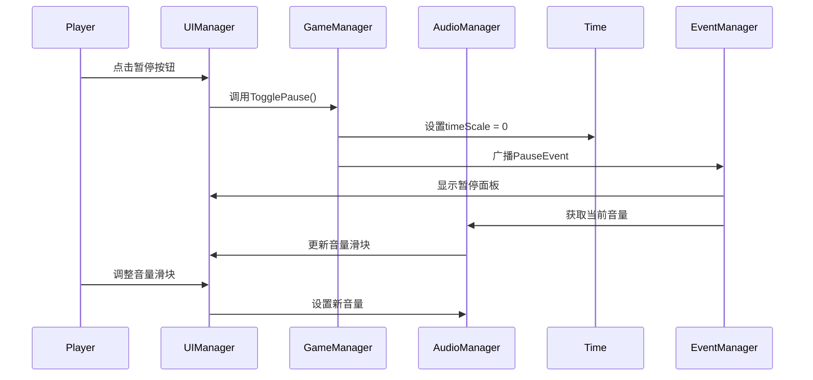
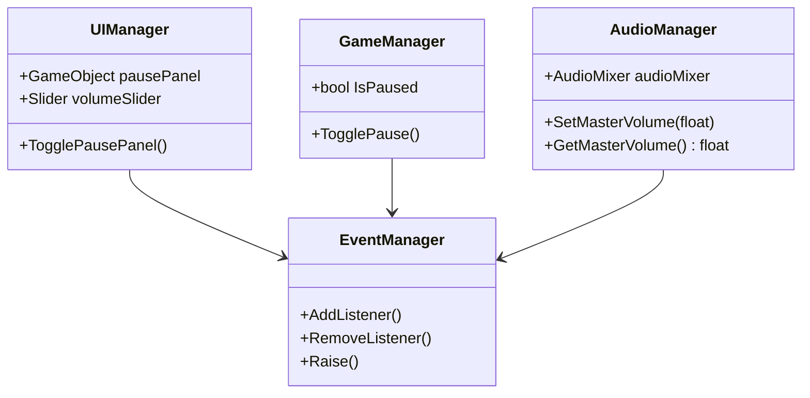

在Unity中实现一个完整的游戏暂停系统，包括暂停功能、音量调节和UI交互。这个系统将让你的游戏更加专业，为玩家提供更好的体验。

## 1. 暂停面板UI设计

### 1.1 创建基础暂停面板

首先，我们创建一个美观的暂停面板UI：

```csharp
1. 在Main Canvas下创建Panel，命名为"PausePanel"
2. 移除默认Image组件，添加Canvas Group组件
3. 设置背景色为黑色，透明度约50%（Alpha值130）
4. 添加Slider控件用于音量调节
5. 添加按钮用于关闭面板
```

```csharp
// 暂停面板初始化代码
public class UIManager : MonoBehaviour
{
    [SerializeField] private GameObject pausePanel;
    [SerializeField] private Slider volumeSlider;
  
    private void Awake()
    {
        pausePanel.SetActive(false);
        volumeSlider.minValue = 0f;
        volumeSlider.maxValue = 1f;
    }
}
```

### 1.2 设置按钮样式

```csharp
// 暂停按钮设置
[SerializeField] private Button settingsButton;
[SerializeField] private Button resumeButton;

private void SetupButtons()
{
    // 设置按钮样式
    settingsButton.onClick.AddListener(TogglePausePanel);
    resumeButton.onClick.AddListener(TogglePausePanel);
  
    // 设置导航
    Navigation customNav = new Navigation();
    customNav.mode = Navigation.Mode.None;
    settingsButton.navigation = customNav;
    resumeButton.navigation = customNav;
}
```

## 2. 游戏暂停逻辑实现

### 2.1 时间缩放控制

Unity中使用`Time.timeScale`控制游戏速度：

```csharp
public class GameManager : MonoBehaviour
{
    public static bool IsPaused { get; private set; }
  
    public void TogglePause()
    {
        IsPaused = !IsPaused;
        Time.timeScale = IsPaused ? 0f : 1f;
    
        // 触发暂停事件
        EventManager.Instance.Raise(new PauseEvent(IsPaused));
    }
}
```

### 2.2 暂停状态下的注意事项

```csharp
1. **物理系统**：Time.timeScale = 0会停止物理模拟
2. **协程**：使用WaitForSecondsRealtime代替WaitForSeconds
3. **音频**：设置AudioSource的ignoreListenerPause属性
4. **UI动画**：使用Unscaled Delta Time
```

```csharp
// 不受暂停影响的音频源设置
audioSource.ignoreListenerPause = true;

// 不受暂停影响的UI动画
void Update()
{
    if(Time.timeScale == 0f)
    {
        transform.localScale += Vector3.one * (0.1f * Time.unscaledDeltaTime);
    }
}
```

## 3. 音量控制系统

### 3.1 Audio Mixer配置

```csharp
1. 创建Audio Mixer (Assets > Create > Audio Mixer)
2. 在Master轨道右键Volume > Expose 'Volume' to script
3. 重命名暴露参数为"MasterVolume"
```

### 3.2 音量滑动条实现

```csharp
public class AudioManager : MonoBehaviour
{
    [SerializeField] private AudioMixer audioMixer;
    private const string MASTER_VOLUME = "MasterVolume";
  
    public void SetMasterVolume(float value)
    {
        // 将0-1的值转换为-80dB到20dB
        float volume = Mathf.Lerp(-80f, 20f, value);
        audioMixer.SetFloat(MASTER_VOLUME, volume);
    
        // 保存音量设置
        PlayerPrefs.SetFloat("MasterVolume", value);
    }
  
    public float GetMasterVolume()
    {
        float volume;
        audioMixer.GetFloat(MASTER_VOLUME, out volume);
        // 将-80dB到20dB转换回0-1
        return Mathf.InverseLerp(-80f, 20f, volume);
    }
}
```

### 3.3 UI音量控制绑定

```csharp
public class VolumeController : MonoBehaviour
{
    [SerializeField] private Slider volumeSlider;
  
    private void Start()
    {
        // 初始化音量
        float savedVolume = PlayerPrefs.GetFloat("MasterVolume", 0.8f);
        volumeSlider.value = savedVolume;
        volumeSlider.onValueChanged.AddListener(OnVolumeChanged);
    }
  
    private void OnVolumeChanged(float value)
    {
        EventManager.Instance.Raise(new VolumeChangedEvent(value));
    }
}
```

## 4. 事件系统集成

### 4.1 自定义事件类

```csharp
// 音量改变事件
public class VolumeChangedEvent : GameEvent
{
    public float Volume { get; }
  
    public VolumeChangedEvent(float volume)
    {
        Volume = volume;
    }
}

// 暂停事件
public class PauseEvent : GameEvent
{
    public bool IsPaused { get; }
  
    public PauseEvent(bool isPaused)
    {
        IsPaused = isPaused;
    }
}
```

### 4.2 事件监听与广播

```csharp
public class UIManager : MonoBehaviour
{
    private void OnEnable()
    {
        EventManager.Instance.AddListener<PauseEvent>(OnPauseStateChanged);
        EventManager.Instance.AddListener<VolumeChangedEvent>(OnVolumeChanged);
    }
  
    private void OnPauseStateChanged(PauseEvent evt)
    {
        pausePanel.SetActive(evt.IsPaused);
    
        // 暂停时同步当前音量
        if(evt.IsPaused)
        {
            float currentVolume = AudioManager.Instance.GetMasterVolume();
            volumeSlider.value = currentVolume;
        }
    }
  
    private void OnVolumeChanged(VolumeChangedEvent evt)
    {
        AudioManager.Instance.SetMasterVolume(evt.Volume);
    }
}
```

## 5. 完整系统集成

### 5.1 暂停流程时序图



### 5.2 系统架构图



## 6. 高级功能扩展

### 6.1 暂停菜单动画

```csharp
public class PausePanelAnimator : MonoBehaviour
{
    [SerializeField] private float animationDuration = 0.3f;
  
    public IEnumerator ShowAnimation()
    {
        CanvasGroup canvasGroup = GetComponent<CanvasGroup>();
        RectTransform rect = GetComponent<RectTransform>();
    
        canvasGroup.alpha = 0f;
        rect.localScale = Vector3.one * 0.8f;
    
        float timer = 0f;
        while(timer < animationDuration)
        {
            timer += Time.unscaledDeltaTime;
            float progress = timer / animationDuration;
        
            canvasGroup.alpha = Mathf.Lerp(0f, 1f, progress);
            rect.localScale = Vector3.Lerp(Vector3.one * 0.8f, Vector3.one, progress);
        
            yield return null;
        }
    }
}
```

## 7. 总结与最佳实践

通过本教程，我们实现了：

1. **完整的暂停系统**：可暂停游戏所有逻辑
2. **音量控制**：通过Audio Mixer实现专业音频控制
3. **事件驱动架构**：保持代码松耦合
4. **数据持久化**：保存玩家音量设置

**最佳实践建议**：

1. 使用Time.timeScale控制游戏速度时注意副作用
2. 为重要游戏事件创建专门的事件类
3. 音量使用对数刻度更符合人耳感知
4. 暂停时考虑禁用不必要的更新以提高性能
5. 添加视觉反馈增强玩家体验