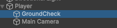
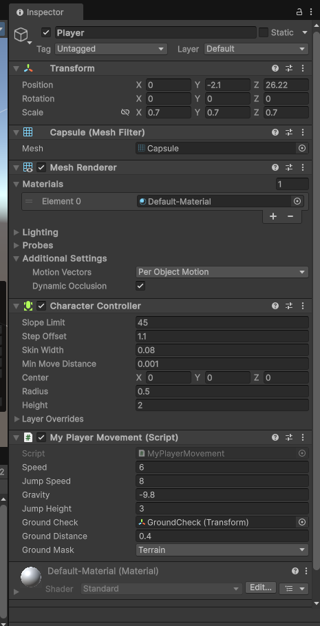
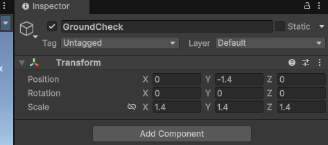
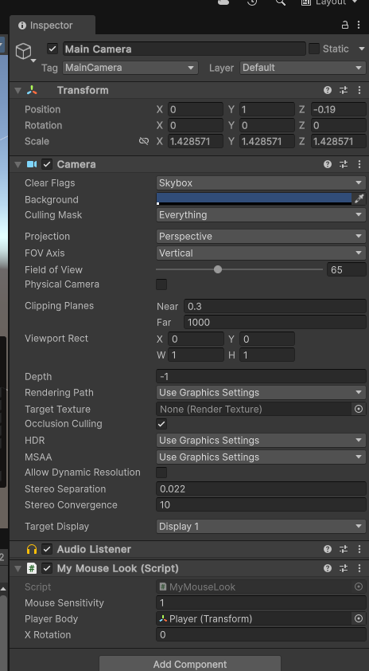

# Unity 游戏开发小技巧：实现基础的角色移动和视角控制

在 Unity 游戏开发中，角色控制是至关重要的一环。本文将介绍如何使用 C# 脚本实现一个简单的角色移动和鼠标视角控制功能。我们将通过两个脚本 `MyPlayerMovement` 和 `MyMouseLook` 来完成这个任务。

## 1. 角色移动脚本 (MyPlayerMovement.cs)

首先，我们来看一下 `MyPlayerMovement` 脚本，它负责处理角色的基本移动，包括前进、后退、左右移动以及跳跃。

```csharp
using System;
using UnityEngine;
using UnityEngine.UIElements;

public class MyPlayerMovement : MonoBehaviour
{

    public float speed = 6.0f;
    public float jumpSpeed = 8.0f;
    public float gravity = -9.8f;
    public float jumpHeight = 3f;


    public Transform groundCheck;
    public float groundDistance = .4f;
    public LayerMask groundMask;


    private Vector3 velocity;
    private CharacterController controller;
    private bool isGrounded;


    private void Start()
    {
        controller = GetComponent<CharacterController>();
    }


    private void Update()
    {
        isGrounded = Physics.CheckSphere(groundCheck.position, groundDistance, groundMask);

        if (isGrounded && velocity.y < 0)
        {
            velocity.y = -2f;
        }

        float horizontal = Input.GetAxis("Horizontal");
        float vertical = Input.GetAxis("Vertical");


        Vector3 moveDirection = transform.right * horizontal + transform.forward * vertical;
        controller.Move(moveDirection * speed * Time.deltaTime);

        if (Input.GetButtonDown("Jump"))
        {
            velocity.y = Mathf.Sqrt(jumpHeight * -2 * gravity);
        }

        velocity.y += gravity * Time.deltaTime;

        controller.Move(velocity * Time.deltaTime);
    }
}
```

**代码解析：**

* **公共变量：**

  * `speed`: 角色移动速度。
  * `jumpSpeed`: 跳跃初始速度（虽然代码中未使用，但可以作为参考）。
  * `gravity`: 重力加速度。
  * `jumpHeight`: 跳跃高度，用于计算初始跳跃速度。
  * `groundCheck`: 一个用于检测角色是否着地的 `Transform` 对象。
  * `groundDistance`: `groundCheck` 检测着地的半径。
  * `groundMask`: 一个图层蒙版，用于指定哪些图层被认为是地面。
* **私有变量：**

  * `velocity`: 角色的当前速度向量。
  * `controller`: `CharacterController` 组件的引用，用于控制角色的移动。
  * `isGrounded`: 一个布尔值，表示角色是否着地。
* **​`Start()`​**  **方法：**  在脚本启动时获取 `CharacterController` 组件。
* **​`Update()`​**  **方法：**  每帧执行以下操作：

  * 使用 `Physics.CheckSphere` 检测角色是否着地。
  * 如果着地且垂直速度小于 0，则将垂直速度重置为一个较小的负值，以确保角色保持在地面上。
  * 获取水平和垂直方向的输入。
  * 根据输入和角色的朝向计算移动方向。
  * 使用 `controller.Move()` 方法应用移动。
  * 当按下 "Jump" 键时，根据 `jumpHeight` 和 `gravity` 计算初始垂直速度，实现跳跃。
  * 应用重力，使角色在空中下落。
  * 使用 `controller.Move()` 方法应用垂直方向的速度。

## 2. 鼠标视角控制脚本 (MyMouseLook.cs)

接下来，我们看一下 `MyMouseLook` 脚本，它负责根据鼠标的移动来控制角色的视角。
```c#
using System;
using UnityEngine;
using UnityEngine.XR;

public class MyMouseLook : MonoBehaviour
{
    public float mouseSensitivity = 1;
    public Transform playerBody;
    public float xRotation = 0f;


    private void Start()
    {
        //这两行代码通常用于在游戏中隐藏鼠标光标并将其锁定在游戏窗口的中心，
        Cursor.lockState = CursorLockMode.Locked;
        Cursor.visible = false;

        mouseSensitivity = 180;

        //于判断当前游戏是否正在 Unity 编辑器中运行。
        if (Application.isEditor)
            mouseSensitivity = 400;
    }

    private float mx;

    private void Update()
    {
        float mouseX = Input.GetAxis("Mouse X") * mouseSensitivity * Time.deltaTime;
        float mouseY = Input.GetAxis("Mouse Y") * mouseSensitivity * Time.deltaTime;


        if (Mathf.Abs(mouseX) > 20 || Mathf.Abs(mouseY) > 20)
            return;

        xRotation -= mouseY;
        // look down or up
        xRotation = Mathf.Clamp(xRotation, -90f, 90f);

        transform.localRotation = Quaternion.Euler(xRotation,0,0);

        // trun left and right
        playerBody.Rotate(Vector3.up * mouseX);
    }
}
```


## 4. 总结

本文介绍了两个简单的 Unity 脚本，用于实现基础的角色移动和鼠标视角控制。你可以根据自己的需求对这些脚本进行修改和扩展，例如添加奔跑、下蹲等功能，或者实现更复杂的视角控制逻辑。希望这篇文章能帮助你入门 Unity 游戏开发！









**注意：**  上图可能展示了在 Unity 编辑器中配置这些脚本的相关设置，例如 Inspector 面板中的参数。你可以参考该图片来更好地理解如何在 Unity 中使用这些脚本。