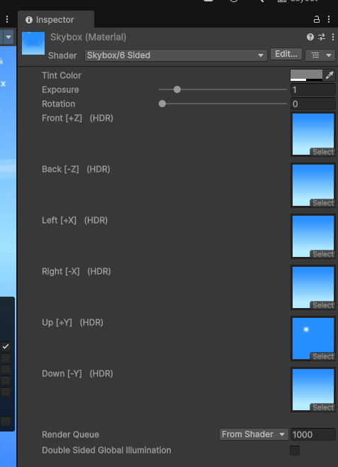
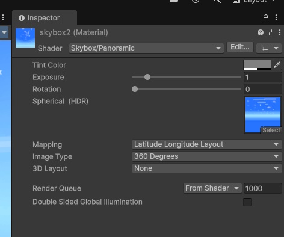

# Unity 场景天空盒修改指南

天空盒是环绕在你的 Unity 场景周围的立方体贴图，它定义了场景的背景。修改天空盒可以极大地改变场景的整体氛围和视觉效果。以下是几种常用的修改天空盒的方法：

## 方法一：通过 Lighting 窗口修改 (推荐)

这是最常用且最直接的方法。

1. **打开 Lighting 窗口：**

    * 在 Unity 编辑器中，点击菜单栏的 **Window** -> **Rendering** -> **Lighting Settings**。
2. **导航到 Environment 选项卡：**

    * 在 Lighting 窗口中，确保你选择了 **Environment** 选项卡。
3. **修改 Skybox Material：**

    * 在 **Environment Lighting** 部分，你会看到一个名为 **Skybox Material** 的属性。
    * 点击该属性旁边的圆形选择器（通常显示 "Default-Skybox"）。
    * 在弹出的资源选择窗口中，你可以：

      * **选择已有的天空盒材质：** 如果你的项目中已经导入了天空盒材质，你可以在这里找到并选择它。
      * **创建新的天空盒材质：** 你可以点击窗口底部的 **Create New Skybox** 按钮来创建不同类型的天空盒材质，例如：

        * **6 Sided：** 使用六张单独的纹理来组成天空盒。你需要为每个面（Up, Down, Left, Right, Front, Back）指定纹理。
        * **Panoramic：** 使用一张全景纹理来创建天空盒。
        * **Procedural：** 创建一个基于参数的程序化天空盒，你可以调整颜色、太阳大小、大气散射等属性。
      * **使用默认天空盒：** 如果你想恢复到默认的天空盒，可以在资源选择器中搜索 "Default-Skybox" 并选择它。
4. **调整其他环境光照设置 (可选)：**

    * 在 Lighting 窗口的 **Environment Lighting** 部分，你还可以调整 **Source**（天空盒、颜色或渐变）、**Ambient Color**、**Environment Reflections** 等设置，这些都会影响场景的整体光照。

## 方法二：通过 Scene 设置资源修改 (如果存在)

某些项目可能会使用 Scene 设置资源来统一管理场景的渲染设置，包括天空盒。

1. **查找 Scene 设置资源：**

    * 在你的 Project 窗口中搜索以 ".asset" 结尾且名称可能包含 "Lighting" 或 "SceneSettings" 的资源。
2. **选择 Scene 设置资源：**

    * 双击找到的 Scene 设置资源，将其选中。
3. **在 Inspector 窗口中修改 Skybox Material：**

    * 在 Inspector 窗口中，你会看到与 Lighting 窗口中 Environment 选项卡类似的设置，包括 **Skybox Material**。
    * 按照方法一的步骤 3 来修改天空盒材质。

## 方法三：通过脚本修改

你也可以在运行时通过脚本来动态修改天空盒。

```csharp
using UnityEngine;

public class ChangeSkybox : MonoBehaviour
{
    public Material newSkyboxMaterial;

    void Start()
    {
        if (newSkyboxMaterial != null)
        {
            RenderSettings.skybox = newSkyboxMaterial;
        }
        else
        {
            Debug.LogError("New Skybox Material is not assigned!");
        }
    }
}
```