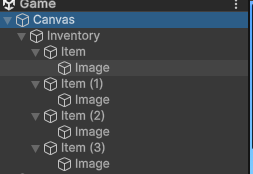
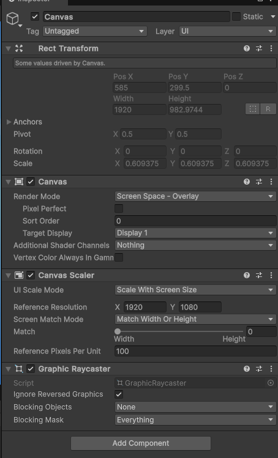
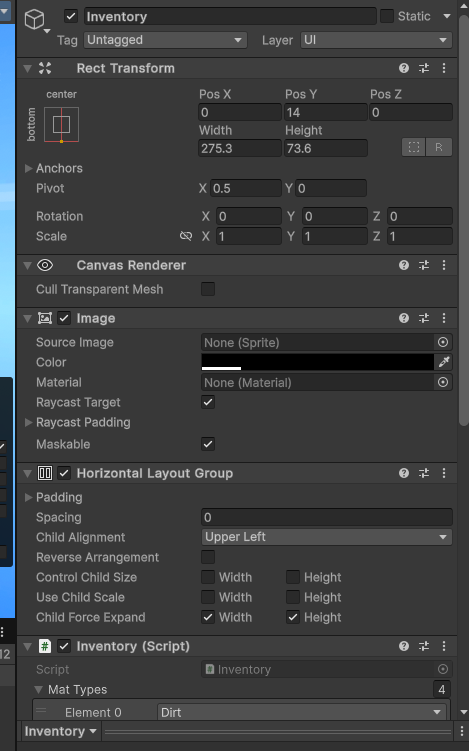
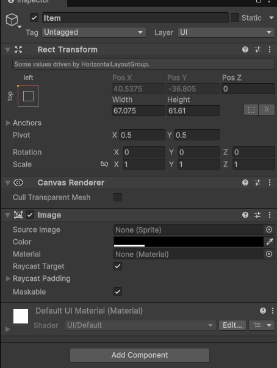
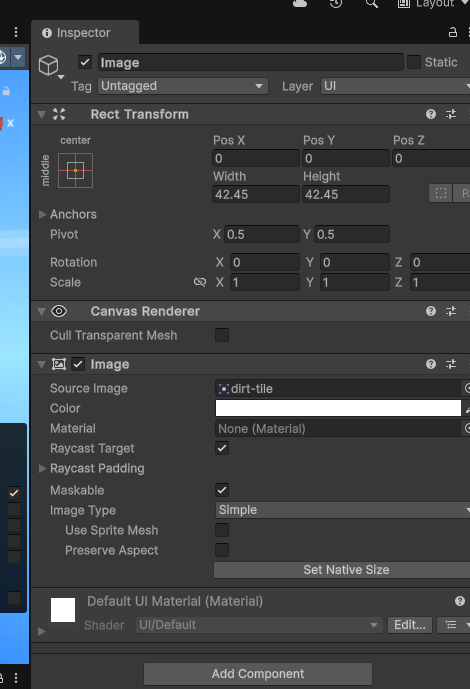

# Unity 游戏开发：构建简单的方块世界 - 地砖、方块与物品栏

在制作类似 Minecraft 的方块世界游戏中，我们需要管理不同类型的地砖（tiles）和方块（blocks），以及一个用于存放这些方块的物品栏（inventory）。本文将介绍实现这些功能的一些基础 C# 脚本。

## 1. 地砖位置管理 (MyTilePos.cs)

`MyTilePos` 脚本的主要目的是管理纹理图集（texture atlas）中每个地砖的 UV 坐标。在一个纹理图集中，不同的地砖图片被排列在一起，我们需要计算出每个地砖在图集中的精确位置，以便在渲染时正确显示。

```csharp
using System.Collections.Generic;
using UnityEngine;

public class MyTilePos
{
    private int xPos, yPos;
    private Vector2uvs;


    public MyTilePos(int xPos, int yPos)
    {
        this.xPos = xPos;
        this.yPos = yPos;
        uvs = new Vector2
        {
            new Vector2(xPos / 16f + .001f, yPos / 16f + .001f),
            new Vector2(xPos / 16f + .001f, (yPos + 1) / 16f - .001f),
            new Vector2((xPos + 1) / 16f - .001f, (yPos + 1) / 16f - .001f),
            new Vector2((xPos + 1) / 16f - .001f, yPos / 16f + .001f),
        };
    }

    public Vector2GetUVs()
    {
        return uvs;
    }

    public static Dictionary<MyTile, MyTilePos> tiles = new Dictionary<MyTile, MyTilePos>()
    {
        {MyTile.Dirt, new MyTilePos(0,0)},
        {MyTile.Grass, new MyTilePos(1,0)},
        {MyTile.GrassSide, new MyTilePos(0,1)},
        {MyTile.Stone, new MyTilePos(0,2)},
        {MyTile.TreeSide, new MyTilePos(0,4)},
        {MyTile.TreeCX, new MyTilePos(0,3)},
        {MyTile.Leaves, new MyTilePos(0,5)},
    };
}


public enum MyTile {Dirt, Grass, GrassSide, Stone, TreeSide, TreeCX, Leaves}
```

**代码解析：**

* **​`MyTilePos`​** **类：**

  * `xPos` 和 `yPos`: 代表地砖在纹理图集中的横纵坐标（假设图集被划分为 16x16 的网格）。
  * `uvs`: 一个包含四个 `Vector2` 元素的数组，代表地砖在纹理图集中的四个角的 UV 坐标。这些坐标用于在渲染时映射纹理。
  * **构造函数** **​`MyTilePos(int xPos, int yPos)`​**​ **:**  接收地砖在图集中的坐标，并根据这些坐标计算出 UV 坐标。这里 `+ .001f` 和 `- .001f` 的小偏移量是为了避免在纹理采样时出现边缘混合的问题。
  * **​`GetUVs()`​**  **方法：**  返回计算得到的 UV 坐标数组。
  * **​`tiles`​** **静态字典：**  将 `MyTile` 枚举类型的地砖与对应的 `MyTilePos` 对象关联起来。例如，`MyTile.Dirt` 对应于图集中坐标 (0, 0) 的地砖。
* **​`MyTile`​** **枚举：**  定义了游戏中可能用到的不同类型的地砖。

## 2. 方块定义 (MyBlock.cs)

`MyBlock` 脚本用于定义游戏中的不同类型的方块。一个方块可能由不同类型的地砖组成，例如草地方块的顶部是草地，侧面是草地侧面，底部是泥土。

```c#
using System.Collections.Generic;
using UnityEditor.Experimental.GraphView;
using UnityEngine;

public class MyBlock
{
    public MyTile top, side, bottom;

    public MyTilePos topPos, sidePos, bottomPos;

    public MyBlock(MyTile tile)
    {
        top = side = bottom = tile;
        GetPositions();
    }

    public MyBlock(MyTile top, MyTile side, MyTile bottom)
    {
        this.top = top;
        this.side = side;
        this.bottom = bottom;
        GetPositions();
    }

    void GetPositions()
    {
        topPos = MyTilePos.tiles[top];
        sidePos = MyTilePos.tiles[side];
        bottomPos = MyTilePos.tiles[bottom];
    }

    public static Dictionary<MyBLockType, MyBlock> blocks = new Dictionary<MyBLockType, MyBlock>(){
        {MyBLockType.Grass, new MyBlock(MyTile.Grass, MyTile.GrassSide, MyTile.Dirt)},
        {MyBLockType.Dirt, new MyBlock(MyTile.Dirt)},
        {MyBLockType.Stone, new MyBlock(MyTile.Stone)},
        {MyBLockType.Trunk, new MyBlock(MyTile.TreeCX, MyTile.TreeSide, MyTile.TreeCX)},
        {MyBLockType.Leaves, new MyBlock(MyTile.Leaves)},
    };
}


public enum MyBLockType{Air,Dirt,Grass,Stone,Trunk,Leaves}
```

**代码解析：**

* **​`MyBlock`​** **类：**

  * `top`, `side`, `bottom`: `MyTile` 类型的变量，分别代表方块的顶部、侧面和底部所使用的地砖类型。
  * `topPos`, `sidePos`, `bottomPos`: `MyTilePos` 类型的变量，分别存储顶部、侧面和底部地砖的 UV 坐标信息。
  * **构造函数** **​`MyBlock(MyTile tile)`​**​ **:**  用于创建所有面都使用相同地砖的方块。
  * **构造函数** **​`MyBlock(MyTile top, MyTile side, MyTile bottom)`​**​ **:**  用于创建每个面使用不同地砖的方块。
  * **​`GetPositions()`​**  **方法：**  根据方块的 `top`, `side`, `bottom` 属性，从 `MyTilePos.tiles` 字典中获取对应的 `MyTilePos` 对象。
  * **​`blocks`​** **静态字典：**  将 `MyBLockType` 枚举类型的方块与对应的 `MyBlock` 对象关联起来。例如，`MyBLockType.Grass` 对应于顶部是草地、侧面是草地侧面、底部是泥土的方块。
* **​`MyBLockType`​** **枚举：**  定义了游戏中可能用到的不同类型的方块。`Air` 类型通常表示空气或空的方块

## 3. 简单的物品栏系统 (MyInventory.cs)

`MyInventory` 脚本实现了一个非常基础的物品栏功能，允许玩家持有和选择不同类型的方块。

```c#
using System;
using UnityEngine;
using UnityEngine.UI;

public class MyInventory : MonoBehaviour
{
    private intmatCounts = new int{ 0, 0, 0, 0, 0 };

    public MyBLockTypemattypes;
    public ImageinvImgs;
    public ImagematImgs;


    private int curMat;


    private void Start()
    {
        foreach (Image img in matImgs)
        {
            img.gameObject.SetActive(false);
        }
    }


    private void Update()
    {
        if (Input.GetKeyDown(KeyCode.Alpha1))
            SetCur(0);
        else if(Input.GetKeyDown(KeyCode.Alpha2))
            SetCur(1);
        else if (Input.GetKeyDown(KeyCode.Alpha3))
            SetCur(2);
        else if  (Input.GetKeyDown(KeyCode.Alpha4))
            SetCur(3);
    }


    void SetCur(int i)
    {
        invImgs[curMat].color = new Color(0, 0, 0, 43 / 255f);
        curMat = i;
        invImgs[i].color = new Color(0, 0, 0, 80 / 255f);
    }

    public Boolean CanPlaceCur()
    {
        return matCounts[curMat] > 0;
    }

    public MyBLockType GetCurBlock()
    {
        return mattypes[curMat];
    }

    void ReduceCur()
    {
        matCounts[curMat]--;
        if(matCounts[curMat]==0)
            matImgs[curMat].gameObject.SetActive(false);
    }

    public void AddToInventory(MyBLockType block)
    {
        int i = 0;
        if (block == MyBLockType.Stone)
            i = 1;
        else if (block == MyBLockType.Trunk)
            i = 2;
        else if (block == MyBLockType.Leaves)
            i = 3;

        matCounts[i]++;
        if(matCounts[i]==1)
            matImgs[i].gameObject.SetActive(false);
    }
}
```

**代码解析：**

* **​`matCounts`​** **数组：**  存储每种方块在物品栏中的数量。
* **​`mattypes`​** **数组：**  存储物品栏中每个槽位对应的 `MyBLockType`。
* **​`invImgs`​** **数组：**  引用物品栏 UI 中用于高亮显示当前选中槽位的 Image 组件。
* **​`matImgs`​** **数组：**  引用物品栏 UI 中用于显示方块图标的 Image 组件。
* **​`curMat`​** **变量：**  存储当前选中的物品栏槽位的索引。
* **​`Start()`​**  **方法：**  在脚本启动时隐藏所有方块图标。
* **​`Update()`​**  **方法：**  监听数字键 1-4 的按下，用于切换当前选中的物品栏槽位。
* **​`SetCur(int i)`​**  **方法：**  设置当前选中的槽位，并更新 UI 的高亮显示效果。
* **​`CanPlaceCur()`​**  **方法：**  检查当前选中的方块在物品栏中是否还有剩余。
* **​`GetCurBlock()`​**  **方法：**  返回当前选中槽位对应的 `MyBLockType`。
* **​`ReduceCur()`​**  **方法：**  将当前选中方块的数量减一，并在数量为零时隐藏对应的图标。
* **​`AddToInventory(MyBLockType block)`​**  **方法：**  将指定类型的方块添加到物品栏中，并更新对应的数量和图标显示。

## 4. 总结

以上三个脚本为构建一个简单的方块世界游戏提供了基础的框架。`MyTilePos` 负责管理地砖在纹理图集中的位置，`MyBlock` 定义了不同类型的方块及其组成地砖，而 `MyInventory` 则实现了一个简单的物品栏系统。你可以根据自己的需求对这些脚本进行扩展和完善，例如添加更多的方块类型、更复杂的物品栏功能等等。







**注意：**  上图可能展示了在 Unity 编辑器中设置物品栏 UI 元素的相关配置，例如将 `MyInventory` 脚本挂载到某个 GameObject 上，并将对应的 `Image` 组件拖拽到脚本的公共变量中。你可以参考该图片来更好地理解如何在 Unity 中使用 `MyInventory` 脚本。