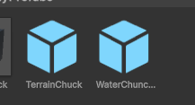
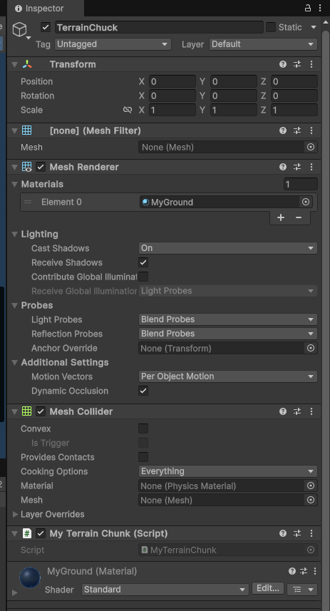
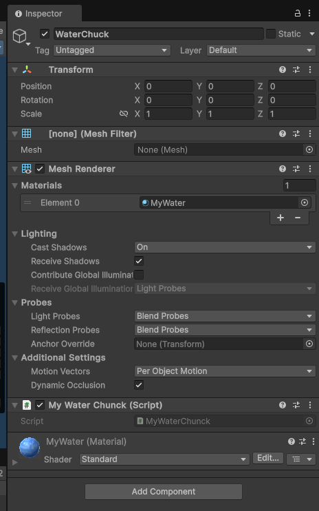
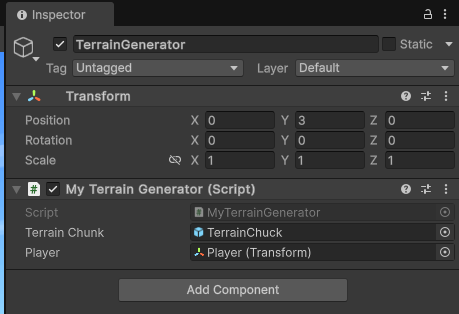

# 使用Unity进行简单的程序化地形生成

大家好！在这篇博客中，我们将一起探索如何使用Unity和C#实现一个简单的程序化地形生成系统。这个系统将包括地形块的生成、水体的创建以及树木的随机分布。让我们深入了解一下实现细节。

## 核心代码概览

我们主要会涉及到以下几个C#脚本：

* `MyTerrainChunk.cs`: 负责单个地形块的网格构建。
* `MyWaterChunck.cs`: 用于创建水体的网格。
* `MyTerrainGenerator.cs`: 控制地形块的生成和管理。
* `MyChunkPos.cs`: 一个简单的结构体，用于表示地形块的位置。
* `MyTilePos.cs`: 定义和管理地形纹理的UV坐标。

接下来，我们将逐个分析这些脚本的功能。

## `MyTerrainChunk.cs`：构建地形块的网格

这个脚本负责创建构成我们地形的单个块（chunk）的网格。

```csharp
using System.Collections.Generic;
using System.Xml; // 注意：这里似乎没有用到 Xml 相关的代码
using UnityEngine;

public class MyTerrainChunk : MonoBehaviour
{
    public const int chunckWidth = 16;
    public const int chunckHeight = 64;

    public MyBLockType[,,] blocks = new MyBLockType[chunckWidth + 2, chunckHeight, chunckWidth + 2];

    public void BuildMesh()
    {
        Mesh mesh = new Mesh();
        List<Vector3> verts = new List<Vector3>();
        List<int> tris = new List<int>();
        List<Vector2> uvs = new List<Vector2>();

        for (int x = 1; x < chunckWidth + 1; x++)
            for(int z=1;z<chunckWidth+1;z++)
                for (int y = 0; y < chunckHeight; y++)
                {
                    if (blocks[x, y, z] != MyBLockType.Air)
                    {
                        Vector3 blockPos = new Vector3(x - 1, y, z);
                        int numFaces = 0;
                        // 检查上方是否有空气，如果有则添加顶面
                        if (y < chunckHeight - 1 && blocks[x, y + 1, z] == MyBLockType.Air)
                        {
                            // 添加顶点
                            verts.Add(blockPos+new Vector3(0,1,0));
                            verts.Add(blockPos+new Vector3(0,1,1));
                            verts.Add(blockPos+new Vector3(1,1,1));
                            verts.Add(blockPos+new Vector3(1,1,0));
                            numFaces++;
                            // 添加UV坐标
                            uvs.AddRange(MyBlock.blocks[blocks[x,y,z]].topPos.GetUVs());
                        }
                        // 检查下方是否有空气，如果有则添加底面
                        if (y > 0 && blocks[x, y - 1, z] == MyBLockType.Air)
                        {
                            verts.Add(blockPos + new Vector3(0, 0, 0));
                            verts.Add(blockPos + new Vector3(1, 0, 0));
                            verts.Add(blockPos + new Vector3(1, 0, 1));
                            verts.Add(blockPos + new Vector3(0, 0, 1));
                            numFaces++;
                            uvs.AddRange(MyBlock.blocks[blocks[x, y, z]].bottomPos.GetUVs());
                        }
                        // front
                        if(blocks[x, y, z - 1] == MyBLockType.Air)
                        {
                            verts.Add(blockPos + new Vector3(0, 0, 0));
                            verts.Add(blockPos + new Vector3(0, 1, 0));
                            verts.Add(blockPos + new Vector3(1, 1, 0));
                            verts.Add(blockPos + new Vector3(1, 0, 0));
                            numFaces++;
                            uvs.AddRange(MyBlock.blocks[blocks[x, y, z]].sidePos.GetUVs());
                        }
                        // right
                        if(blocks[x + 1, y, z] == MyBLockType.Air)
                        {
                            verts.Add(blockPos + new Vector3(1, 0, 0));
                            verts.Add(blockPos + new Vector3(1, 1, 0));
                            verts.Add(blockPos + new Vector3(1, 1, 1));
                            verts.Add(blockPos + new Vector3(1, 0, 1));
                            numFaces++;
                            uvs.AddRange(MyBlock.blocks[blocks[x, y, z]].sidePos.GetUVs());
                        }
                        // back
                        if(blocks[x, y, z + 1] == MyBLockType.Air)
                        {
                            verts.Add(blockPos + new Vector3(1, 0, 1));
                            verts.Add(blockPos + new Vector3(1, 1, 1));
                            verts.Add(blockPos + new Vector3(0, 1, 1));
                            verts.Add(blockPos + new Vector3(0, 0, 1));
                            numFaces++;
                            uvs.AddRange(MyBlock.blocks[blocks[x, y, z]].sidePos.GetUVs());
                        }
                        // left
                        if(blocks[x - 1, y, z] == MyBLockType.Air)
                        {
                            verts.Add(blockPos + new Vector3(0, 0, 1));
                            verts.Add(blockPos + new Vector3(0, 1, 1));
                            verts.Add(blockPos + new Vector3(0, 1, 0));
                            verts.Add(blockPos + new Vector3(0, 0, 0));
                            numFaces++;
                            uvs.AddRange(MyBlock.blocks[blocks[x, y, z]].sidePos.GetUVs());
                        }

                        // 添加三角形索引
                        int tl = verts.Count - 4 * numFaces;
                        for (int i = 0; i < numFaces; i++)
                        {
                            tris.AddRange(new int{ tl + i * 4, tl + i * 4 + 1, tl + i * 4 + 2, tl + i * 4, tl + i * 4 + 2, tl + i * 4 + 3 });
                        }
                    }
                }

        mesh.vertices = verts.ToArray();
        mesh.triangles = tris.ToArray();
        mesh.uv = uvs.ToArray();

        mesh.RecalculateNormals();
        GetComponent<MeshFilter>().mesh = mesh;
        GetComponent<MeshCollider>().sharedMesh = mesh;
    }
}
```

这个脚本定义了地形块的宽度和高度，并使用一个三维数组 `blocks` 来存储每个位置的方块类型。`BuildMesh` 方法遍历每个方块，并检查其相邻的方块是否为空气。如果相邻方块是空气，则为当前方块的相应面添加顶点、三角形和UV坐标。这样做的目的是为了只渲染暴露在空气中的方块面，从而提高性能。最后，它将生成的网格数据应用到 `MeshFilter` 和 `MeshCollider` 组件上。

## `MyWaterChunck.cs`：创建水体网格

这个脚本用于生成一个简单的水面。

```c#
using System.Collections.Generic;
using UnityEngine;

public class MyWaterChunck : MonoBehaviour
{
    public const int waterHeight = 28;
    public int[,] locs = new int[16, 16];

    void Start()
    {
        transform.localPosition = new Vector3(0, waterHeight, 0);
    }

    public void SetLocs(MyBLockType[,,] blocks)
    {
        int y;
        for (int x = 0; x < 16; x++)
        {
            for (int z = 0; z < 16; z++)
            {
                locs[x, z] = 0;
                y = MyTerrainChunk.chunckHeight - 1;
                while (y > 0 && blocks[x + 1, y, z + 1] == MyBLockType.Air)
                {
                    y--;
                }
                if (y + 1 < waterHeight)
                    locs[x, z] = 1;
            }
        }
    }

    private Vector2uvpat = new Vector2
        { new Vector2(0, 0), new Vector2(0, 1), new Vector2(1, 1), new Vector2(1, 0) };

    public void BuildMesh()
    {
        Mesh mesh = new Mesh();
        List<Vector3> verts = new List<Vector3>();
        List<int> tris = new List<int>();
        List<Vector2> uvs = new List<Vector2>();

        for(int x=0;x<16;x++)
        for (int z = 0; z < 16; z++)
        {
            if (locs[x, z] == 1)
            {
                verts.Add(new Vector3(x, 0, z));
                verts.Add(new Vector3(x, 0, z+1));
                verts.Add(new Vector3(x+1, 0, z+1));
                verts.Add(new Vector3(x+1, 0, z));

                verts.Add(new Vector3(x, 0, z));
                verts.Add(new Vector3(x, 0, z + 1));
                verts.Add(new Vector3(x + 1, 0, z + 1));
                verts.Add(new Vector3(x + 1, 0, z));

                uvs.AddRange(uvpat);
                uvs.AddRange(uvpat);
                int tl = verts.Count - 8;
                tris.AddRange(new int{ tl, tl + 1, tl + 2, tl, tl + 2, tl + 3,
                    tl+3+4,tl+2+4,tl+4,tl+2+4,tl+1+4,tl+4});
            }
        }

        mesh.vertices = verts.ToArray();
        mesh.triangles = tris.ToArray();
        mesh.uv = uvs.ToArray();

        mesh.RecalculateNormals();
        GetComponent<MeshFilter>().mesh = mesh;
    }
}
```

`MyWaterChunck` 脚本定义了水面的高度。`SetLocs` 方法接收地形块的数据，并判断哪些位置应该生成水面。如果某个位置的地形低于预设的水面高度，则在该位置标记为需要生成水。`BuildMesh` 方法则根据标记的位置生成一个简单的平面网格作为水面。

## `MyTerrainGenerator.cs`：控制地形的生成

这是整个地形生成系统的核心脚本。

```c#
using System.Collections;
using System.Collections.Generic;
using UnityEngine;

public class MyTerrainGenerator : MonoBehaviour
{
    public GameObject terrainChunk;
    public Transform player;
    public static Dictionary<MyChunkPos, MyTerrainChunk> chunks = new Dictionary<MyChunkPos, MyTerrainChunk>();
    private FastNoise noise = new FastNoise();
    private int chunkDist = 5;
    private List<MyTerrainChunk> pooledChunks = new List<MyTerrainChunk>();
    private List<MyChunkPos> toGenerate = new List<MyChunkPos>();

    private void Start()
    {
        LoadChunks(true);
    }

    private void Update()
    {
        LoadChunks();
    }

    void BuildChunk(int xPos, int zPos)
    {
        MyTerrainChunk chunk;
        if (pooledChunks.Count > 0)
        {
            chunk = pooledChunks[0];
            chunk.gameObject.SetActive(true);
            pooledChunks.RemoveAt(0);
            chunk.transform.position = new Vector3(xPos, 0, zPos);
        }
        else
        {
            GameObject chunckGO = Instantiate(terrainChunk, new Vector3(xPos, 0, zPos), Quaternion.identity);
            chunk = chunckGO.GetComponent<MyTerrainChunk>();
        }

        for(int x=0;x<MyTerrainChunk.chunckWidth +2;x++)
            for(int z=0;z<MyTerrainChunk.chunckWidth+2;z++)
                for (int y = 0; y < MyTerrainChunk.chunckHeight; y++)
                    chunk.blocks[x, y, z] = GetBlockType(xPos + x - 1, y, zPos + z - 1);

        GenerateTrees(chunk.blocks, xPos, zPos);
        chunk.BuildMesh();

        MyWaterChunck wat = chunk.transform.GetComponentInChildren<MyWaterChunck>();
        wat.SetLocs(chunk.blocks);
        wat.BuildMesh();

        chunks.Add(new MyChunkPos(xPos,zPos),chunk);
    }

    MyBLockType GetBlockType(int x, int y, int z)
    {
        float simplex1 = noise.GetSimplex(x * .8f, z * .8f) * 10;
        float simplex2 = noise.GetSimplex(x * 3f, z * 3f) * 10 * (noise.GetSimplex(x * .3f, z * .3f) + .5f);
        float heightMap = simplex1 + simplex2;
        float baseLandHeight = TerrainChunk.chunkHeight * .5f + heightMap;
        float caveNoise1 = noise.GetPerlinFractal(x * 5f, y * 10f, z * 5f);
        float caveMask = noise.GetSimplex(x * .3f, z * .3f) + .3f;
        float simplexStone1 = noise.GetSimplex(x * 1f, z * 1f) * 10;
        float simplexStone2 =
            (noise.GetSimplex(x * 5f, z * 5f) + .5f) * 20 * (noise.GetSimplex(x * .3f, z * .3f) + .5f);
        float stoneHeightMap = simplexStone1 + simplexStone2;
        float baseStoneHeight = TerrainChunk.chunkHeight * .25f + stoneHeightMap;
        MyBLockType bLockType = MyBLockType.Air;
        if (y<= baseLandHeight)
        {
            bLockType = MyBLockType.Dirt;
            if (y > baseLandHeight - 1 && y > WaterChunk.waterHeight - 2)
                bLockType = MyBLockType.Grass;
            if (y <= baseStoneHeight)
                bLockType = MyBLockType.Stone;
        }
        if (caveNoise1 > Mathf.Max(caveMask, .2f))
            bLockType = MyBLockType.Air;
        return bLockType;
    }

    private MyChunkPos curChunk = new MyChunkPos();

    void LoadChunks(bool instant = false)
    {
        int curChunkPosX = Mathf.FloorToInt(player.position.x / 16) * 16;
        int curChunkPosZ = Mathf.FloorToInt(player.position.z / 16) * 16;

        if (curChunk.x != curChunkPosX || curChunk.z != curChunkPosZ)
        {
            curChunk.x = curChunkPosX;
            curChunk.z = curChunkPosZ;

            for(int i = curChunkPosX - 16 * chunkDist;i<curChunkPosX+16*chunkDist;i+=16)
            for (int j = curChunkPosZ - 16 * chunkDist; j <= curChunkPosZ + 16; j += 16)
            {
                MyChunkPos cp = new MyChunkPos(i, j);
                if (!chunks.ContainsKey(cp) && !toGenerate.Contains(cp))
                {
                    if(instant)
                        BuildChunk(i,j);
                    else
                        toGenerate.Add(cp);
                }
            }

            List<MyChunkPos> toDestory = new List<MyChunkPos>();
            foreach (KeyValuePair<MyChunkPos,MyTerrainChunk> c in chunks)
            {
                MyChunkPos cp = c.Key;
                if (Mathf.Abs(curChunkPosX - cp.x) > 16 * (chunkDist + 3) ||
                    Mathf.Abs(curChunkPosZ - cp.z) > 16 * (chunkDist + 3))
                {
                    toDestory.Add(c.Key);
                }
            }

            foreach (MyChunkPos cp in toDestory)
            {
                chunks[cp].gameObject.SetActive(false);
                pooledChunks.Add(chunks[cp]);
                chunks.Remove(cp);
            }
            StartCoroutine(DelayBuildChunks());
        }
    }

    void GenerateTrees(MyBLockType[,,] blocks, int x, int z)
    {
        System.Random rand = new System.Random(x * 10000 + z);
        float simplex = noise.GetSimplex(x * .8f, z * .8f);
        if (simplex > 0)
        {
            simplex *= 2f;
            int treeCount = Mathf.FloorToInt((float)rand.NextDouble() * 5 * simplex);
            for (int i = 0; i < treeCount; i++)
            {
                int xPos = (int)(rand.NextDouble() * 14) + 1;
                int zPos = (int)(rand.NextDouble() * 14) + 1;
                int y = MyTerrainChunk.chunckHeight - 1;
                while (y > 0 && blocks[xPos, y, zPos] == MyBLockType.Air)
                {
                    y--;
                }
                y++;
                int treeHeight = 4 + (int)(rand.NextDouble() * 4);
                for (int j = 0; j < treeHeight; j++)
                {
                    if (y + j < 64)
                        blocks[xPos, y + j, zPos] = MyBLockType.Trunk;
                }
                int leavesWidth = 1 + (int)(rand.NextDouble() * 6);
                int levesHeight = (int)(rand.NextDouble() * 3);
                int iter = 0;
                for(int m = y + treeHeight - 1; m <= y + treeHeight - 1 + treeHeight; m++)
                {
                    for(int k = xPos - (int)(leavesWidth * .5)+iter/2; k <= xPos + (int)(leavesWidth * .5)-iter/2; k++)
                    for(int l = zPos - (int)(leavesWidth * .5)+iter/2; l <= zPos + (int)(leavesWidth * .5)-iter/2; l++)
                    {
                        if(k >= 0 && k < 16 && l >= 0 && l < 16 && m >= 0 && m < 64 && rand.NextDouble() < .8f)
                            blocks[k, m, l] = MyBLockType.Leaves;
                    }
                    iter++;
                }
            }
        }
    }

    IEnumerator DelayBuildChunks()
    {
        while (toGenerate.Count > 0)
        {
            BuildChunk(toGenerate[0].x,toGenerate[0].z);
            toGenerate.RemoveAt(0);
            yield return new WaitForSeconds(.2f);
        }
    }
}
```

`MyTerrainGenerator` 脚本负责管理地形块的生成和销毁。它使用 `FastNoise` 库生成噪声，并根据噪声值来决定每个位置的方块类型（例如，空气、泥土、草、石头）。

* **​`Start()`​**  **和** **​`Update()`​**​ **:**  在游戏开始时以及每一帧都会调用 `LoadChunks` 方法来加载或卸载地形块，实现动态加载。
* **​`BuildChunk(int xPos, int zPos)`​**​ **:**  这个方法根据给定的位置创建或重用一个地形块。它首先从对象池中尝试获取可用的地形块，如果没有则实例化一个新的。然后，它填充地形块的 `blocks` 数组，生成树木，构建网格，并创建相应的水体块。
* **​`GetBlockType(int x, int y, int z)`​**​ **:**  这个方法是根据三维坐标使用噪声函数来确定方块类型的核心逻辑。它结合了多个噪声样本来创建更复杂的地形特征，例如高度变化、洞穴和不同的地层（泥土、草、石头）。
* **​`LoadChunks(bool instant = false)`​**​ **:**  这个方法根据玩家的位置动态地加载和卸载地形块。它计算玩家当前所在的区块，并加载周围一定范围内的区块。超出范围的区块会被放入对象池以便后续重用。为了避免一次性生成大量区块导致的性能问题，新区块的生成使用了协程 `DelayBuildChunks` 来延迟执行。
* **​`GenerateTrees(MyBLockType[,,] blocks, int x, int z)`​**​ **:**  这个方法使用随机数和噪声函数在地形块上生成树木。它首先判断该区域是否应该生成树木，然后随机确定树木的位置和高度，并在相应的 `blocks` 数组中标记为树干和树叶。
* **​`DelayBuildChunks()`​**​ **:**  这是一个协程，用于延迟生成待生成的地形块，避免瞬间创建大量对象导致卡顿。

## `MyChunkPos.cs`：表示地形块的位置

这是一个简单的结构体，用于存储地形块在XZ平面上的坐标。

```c#
public struct MyChunkPos
{
    public int x, z;

    public MyChunkPos(int x, int z)
    {
        this.x = x;
        this.z = z;
    }
}
```

它主要用作 `MyTerrainGenerator` 中字典的键，方便查找和管理已生成的地形块。

## `MyTilePos.cs`：管理地形纹理的UV坐标

这个脚本定义了地形中不同类型的方块所对应的纹理UV坐标。

```c#
using System.Collections.Generic;
using UnityEngine;

public class MyTilePos
{
    private int xPos, yPos;
    private Vector2uvs;

    public MyTilePos(int xPos, int yPos)
    {
        this.xPos = xPos;
        this.yPos = yPos;
        uvs = new Vector2
        {
            new Vector2(xPos / 16f + .001f, yPos / 16f + .001f),
            new Vector2(xPos / 16f + .001f, (yPos + 1) / 16f - .001f),
            new Vector2((xPos + 1) / 16f - .001f, (yPos + 1) / 16f - .001f),
            new Vector2((xPos + 1) / 16f - .001f, yPos / 16f + .001f),
        };
    }

    public Vector2GetUVs()
    {
        return uvs;
    }

    public static Dictionary<MyTile, MyTilePos> tiles = new Dictionary<MyTile, MyTilePos>()
    {
        {MyTile.Dirt, new MyTilePos(0,0)},
        {MyTile.Grass, new MyTilePos(1,0)},
        {MyTile.GrassSide, new MyTilePos(0,1)},
        {MyTile.Stone, new MyTilePos(0,2)},
        {MyTile.TreeSide, new MyTilePos(0,4)},
        {MyTile.TreeCX, new MyTilePos(0,3)},
        {MyTile.Leaves, new MyTilePos(0,5)},
    };
}

public enum MyTile {Dirt, Grass, GrassSide, Stone, TreeSide, TreeCX, Leaves}
```

它使用一个字典 `tiles` 将 `MyTile` 枚举类型（定义了不同的地形纹理）映射到具体的UV坐标。在 `MyTerrainChunk` 中构建网格时，会根据方块的类型从这个字典中获取相应的UV坐标。

## 总结

通过以上脚本的协同工作，我们实现了一个简单的基于方块的程序化地形生成系统。`MyTerrainGenerator` 负责根据玩家的位置和噪声函数生成不同类型的地形块，`MyTerrainChunk` 则负责将这些数据转化为可渲染的网格，`MyWaterChunck` 创建了水面，而 `MyChunkPos` 和 `MyTilePos` 则分别用于管理地形块的位置和纹理。

这只是一个非常基础的实现，你可以根据自己的需求进行扩展，例如添加更多的地形特征、更复杂的噪声函数、不同的生物群系等等。希望这篇博客能帮助你理解程序化地形生成的基本原理！